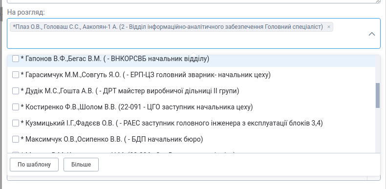

# Change Log
All notable changes to this project will be documented in this file.

The format is based on [Keep a Changelog](http://keepachangelog.com/)
and this project adheres to [Semantic Versioning](http://semver.org/).

## [Unreleased]
### Added

### Changed

### Deprecated

### Removed

### Fixed

## [5.20.26] - 2021-09-24
### Fixed
 - `UTableEntity`: remove excessive control scrollbar after adding of the slot for the left sidebar

## [5.20.25] - 2021-09-17
### Fixed
 - `USelectEntity` - fix the previous fix "for entities with dataHistory mixin added strike out + timer icon in case selected record is out of date"

## [5.20.24] - 2021-09-16
### Added
 - `UAutoField`: in addition to selected value added pass of entire selected option to `input` event
 - `USelectEntity` - for entities with dataHistory mixin added strike out + timer icon in case selected record is out of date
 - `UTableEntity`: slot `sidebar` to render content on the left side of the table or card-view

### Changed
 - UTableEntity HTML export rewritten to use client-side export:
   - output only columns visible in grid
   - take into account formatting function, so output a captions instead of IDs for Entity columns
   - added column caption translation
   - added table header (as in Excel export)

### Fixed
 - `UTableEntity`: calculate totals on columns of `Currency` type (missed before fix) by inherits
   column `summaryAggregationOperator` from `Number` column type definition
 - `UTableEntity`: allows to display a result of repository with a groupBy statement
     - avoid adding an 'ID' attribute to the fieldList if repository contains a `groupBy` clause
     - expect first attribute to be a unique key (used instead of ID to generate a key for vue)
     - possible repository example:
```javascript
return UB.Repository('uba_auditTrail')
  .attrs('MAX([ID])','max([actionTime])', 'document.regNumber', 'actionDate', 'actionType')
  .where('document.ID', 'isNotNull')
  .groupBy(['document.regNumber', 'actionDate', 'actionType'])
```

## [5.20.23] - 2021-09-08
### Added
 - `addCollectionItemWithoutDefaultValues` - new `Vuex` action - such as `addCollectionItem` but does not fetch default params
 - `UToolbar`: `showDropdown` prop that allows preventing rendering of the dropdown menu
 - `toValidate` property to the `UTableColumn`, which allows skipping checking the column in the `validateFieldList` method - useful for custom unfamiliar columns
 - `$lookups.getEnumItems` method returns array of `{code: string, name: string}` enum items ordered by sort order for
   the given `eGroup`, for example: `$lookups.getEnumItems('ORG_UNITTYPE')` returns:
   ```json
   [
     {
       "code": "STAFF",
       "name": "Staff unit"
     },
     {
       "code": "ORG",
       "name": "Organization"
     },
     {
       "code": "DEP",
       "name": "Department"
     },
     {
       "code": "EXECGROUP",
       "name": "Execution group"
     }
   ]
   ```
 - `UTable`: set title for cell with long text and three dots in the end  [UBDF-14278)

### Changed
 - `UTableEntity`: now show filter control if there are no available columns for filtration
 - improved the table for displaying and the form for adding and management entries of the `aclRls` mixin for some entity
 - `USelectMultiple`: change style for dropdown. Fixed the position of the buttons "More", "Template" and other.

[Task](https://dev.intecracy.com/agile/browse/UBDF-8423)

### Fixed
 - `UCardView`: rendering of values if the cell template is not defined for the related column
 - `UFormRow`: fix very long tags in `USelectMultiple`. Now, tags is flexible, has max-width: 100% from parent and don't come out beyound the viewport
 - `UDatePicker`: removed hard width. Datepicker width is flexible between 150px to 220px

## [5.20.22] - 2021-09-02
### Added
 - `Form/mount`: added param `onClose`, this is a callback function that, if defined, is called
 from the `beforeDestroy` lifecycle hook

## [5.20.21] - 2021-08-31
### Changed
 - Dutch localization correction

### Fixed
 - `UBaseInput`, type=number: set value as a number on `input` event (type every character) instead of on `change` event,
 where value may be a string
 - `UDropdown`: fixed placement of dropdown on first click, prevented from expanding outside of viewport [UBDF-13695]
 - `USelectEntity`: fixed adding new row in `allowDictionaryAdding` mode in case user type text quickly (`blur` event handler fixed) 
 - `USelectEntity`: removed `leaveInput` on `@keydown.native.tab`, because now it is called on `blur` event

## [5.20.20] - 2021-08-18
### Added
 - `UButton`: added `circle` prop to render a circle button - see [UButton UI doc](https://unitybase.info/api/adminui-vue/index.html#/Presentational/UButton) 

### Changed
 - `UCodeMirror`: set minimum height to 50 px to make help icon be inside control if it has only one line
 - almost all (except ones where HTML is rendered) `el-tooltip` are replaced with
   [HTML `title` property](https://developer.mozilla.org/en-US/docs/web/html/global_attributes/title)

### Removed
 - `USidebarButton` component is removed. `UButton` should be used instead.

## [5.20.19] - 2021-08-09
## [5.20.18] - 2021-08-04
### Added
 - `UTableEntity`: slot `appendTable` to add some content at the end of the table after the pagination button
 - Dutch (nl) localization

### Changed
 - forcibly disabled HTML page translator (Google Translate) for login page

### Fixed
 - `USelectEntity`: fixed entity name in dictionary adding dialog in case of repository use
 - `UCodeMirror`: revert removing of `editorInstance` computed value since it exists for external use
 - `USelectEntity`: prevent trigger of dropdown action in case on `Enter` is pressed in some other control of the form
 - `UFormRow`: fixed automatic label title if the attribute's description text is not defined

## [5.20.17] - 2021-07-18
### Added
 - `USelectEnum`: added `repository` prop, same as `USelectEntity` has
 - `UCardView`: added support for field slots in `Card view`. Same behavior as in `Table view`
 - `UTableEntity`: prop `withPagination` for controlling the availability of the table pagination
 - `UTableEntity`: slot `lastTableRow` to display specific content in the last row of the table

### Fixed
 - `USelectEntity`: fixed `More` button for non-editable controls - after the click
   the dropdown list was reopened, and the same set of rows was fetched instead of the next one.
 - `UFormRow`: fixed typo in prop name 'descripion' -> 'description'
 - `UCodeMirror`: fix updating of the control's value when `valueIsJson=true` and user inputed a number

## [5.20.16] - 2021-07-08
### Added
 - `UFormRow`: `attributeName` property - if it is passed, control automatically gets attribute label, required and error
 - new provided value in Vue instances: `validator`. This value contains useful methods for form validation
 - new helper `validateWithErrorText` for defining of attribute validation functions with an error text
 - `validationMixin` for the passing of validation defined locally in some Vue component to nested controls (UFormRow for example)
 - Validation: added support for `$each` captions in validations.  Example:
   `crimeCases.$each.11.data.$each.333.val.discardReason:caption` => `crimeCases.data.val.discardReason:caption`
 - UAutoField: in case attribute used in `attribute-name` prop does not exist in Repository a developer-friendly
   exception is throws instead of `can not read XXX of undefined`
 - `USelectMultiple`: new prop `additionalButtons`, for add buttons to dropdown before button 'more'
 - `USelectEntity`: new prop `allow-dictionary-adding`. If defined and user type text what not match any record -
   will ask for adding a new record into dictionary. Record parameters must be defined in `build-add-dictionary-config` handler

### Changed
 - refactored and improved validation of forms. [Documentation](https://git-pub.intecracy.com/unitybase/ubjs/-/blob/master/packages/adminui-vue/utils/Form/validation.md)
 - use `attributeCaptions` section to define captions for custom attributes or redefine for entity ones
  instead of computed property with `:caption` suffix
 - `UFormRow`: display attribute description if exists instead of name when we hover on the label
 - `u-select-entity` & `u-select-multiple` drop-down is shown after fetch, so in case some old values are in options
   they will not be shown to the user
  
### Removed
 - `getValidationState` provided value since now it is a method of validator

### Fixed
- `USelectEntity` prevent click on disable menu items

## [5.20.15] - 2021-06-14
### Added
 - `SignatureVerificationResult` - added a media type information (file/hardware)
 - `window.capiSelectionDialog` - a Vue based interface for cryptographic module selection (used by UB EE/DE)
 - `UNavbarNotificationsButton`: added opening of unread notifications with the `messageType` === `system`
  in the modal window for the user when logging into the system.
 - `processing.saved`: pass method name `insert/update` as second argument into a `saved` hook on form

### Changed
 - *BREAKING* UCodeMirror attribute renamed `readOnly` -> `readonly`;
   This fix u-auto-field readonly binding in case attribute is on Json type 

### Fixed
- `computedVuex` - pass `key` property to `SET` mutation

## [5.20.14] - 2021-05-24
### Added
 - *temporary solution, not recommended to use - validation will be re-thinks*: validation error message
   can get a validation rule caption from the property with the same name as validation rule + `:caption` suffix. Example:
```js
module.exports.mount = cfg => {
  Form(cfg)
    .store()
    .processing()
    .validation({
      ...mapState('form', ['dataProvider']),

      computed: {
        dateFrom: this.dateFrom, // dateFrom is a validation rule name
        'dateFrom:caption': this.$ut('Date from'),
        nestedData() { // the same name as validation rule
          return {
            color: this.nestedData.color,
            'color:caption': this.$ut('form_captions.defaultValueOf', 'color'),
          }
        }
      },
      validations() {
        return {
          dateFrom: {required}, // a validation rule name
          nestedData: {
            color: {required},
          }
        }
      }
    })
    .mount()
}
```
 - `UTableEntity` in "Card" mode pass a full row to the `dblclick` event - the same behavior as with double-click on table row 

### Fixed
- allow mount Vue container directly in Ext tabpanel

## [5.20.13] - 2021-05-13
### Fixed
 - fix dialog* and lookups export from `@unitybase/adminui-vue`

## [5.20.12] - 2021-05-13
### Added
 - `processing.js`: `refresh` method emits a `UB.connection.emit(`${masterEntityName}:refresh`, {ID: state.data.ID})` event.
 - possibility to add a validation for not-entity attributes in the `Form.validation(...)` section.
  For such field two computed properties can be defined:
    - a computed property that return a field value
    - a computed property `${field}:caption` that return localized field name for error dialog.
      
  Example:
```js
module.exports.mount = cfg => {
  Form(cfg)
    .store()
    .processing()
    .validation({
      ...mapState('form', [
        'dataProvider'
      ]),

      computed: {
        colorDefaultValue() {
          return this.dataProvider.getDefaultValueFor('color')
        },

        'colorDefaultValue:caption'() {
          return this.$ut('forms_errors.invalidDefaultValue', 'color')
        }
      },

      validations() {
        return {
          colorDefaultValue: {
            required
          }
        }
      }
    })
    .mount()
}

```

### Changed
 - `validations() {...}` *BREAKING* this option is deep [merged](https://vuejs.org/v2/api/#optionMergeStrategies)
  not overridden by another from another mixin now. This allows you to reuse mixins with partial validation

## [5.20.11] - 2021-05-07
### Changed
 - UDatePicker improvements:
   - documentation added - see https://unitybase.info/api/adminui-vue/index.html#/Presentational/UDatePicker
   - panels for ranges are unlinked by default (month can be changed separately)
   - placeholder i18n for date range changed from `Start Date - End Date` to `from - to`  ( `з - по` for uk)
   - added defaults shortcuts. For date - Today and Yesterday, for range Today, Yesterday and "current month"
 - FTS widget and "range" date filter for 'UTable' uses `u-date-picker` with all options is default    

### Fixed
 - fixed `UB.truncTimeToUTCNull is not a function`, valid method name is `UB.truncTimeToUtcNull` (UTC -> Utc)
 - autoforms fixed (was broken by 5.20.10 refactoring)
 - `UAutoFiled` for Date and DateTime sets u-date-picker `clearable` to `false` for attributes what do not allow nulls 

## [5.20.10] - 2021-05-05
### Added
 - `exportFormatXlsColumn` - new method in column configuration for the `UTable`. This method is useful
  when you want to set some specific format in an `Excel` file for this column
 - all available dialogs now exported as `uDialogs` object from `adminui-vue` packages.
   Dialogs functions are documented in [adminui-vue documentation on site](https://unitybase.info/api/ubpub-v5/module-@unitybase_adminui-vue.html)
 - adminui-vue `lookups` submodule documentation
 - adminui-vue `helpers` and `processing` submodules documentation
 - adminui-vue exports a `helpers` submodule as `formHelpers`.
   A direct `require('@unitybase/adminui-vue/utils/Form/helpers')` should be replaced to `require('@unitybase/adminui-vue').formHelpers` 

### Changed
 - `computedVuex` *BREAKING* signature changed to accept (optional) submodule name as a second argument
 - `mapInstanceFields` *BREAKING* signature changed to accept (optional) submodule name as a second argument
 - `helpers.isEqual` (used to check store is changed) for array elements return `false` in case length of array is not match.
   Before this changes `helpers.isEqual([1, 2], [2, 1, 1])` returns `true`
 - a theme CSS variable `--l-layout-border-default` changed from 80% to 70% to adjust a `u-*` controls border color with `el-*` ones

### Fixed
 - `lookups`: clean `mapById` object during last `unsubscribe` (as well as data array is cleaned)

## [5.20.9] - 2021-04-24
## [5.20.8] - 2021-04-22
### Fixed
 -`UForm`: fix messages for errors what can be thrown inside `UForm.mount`

## [5.20.7] - 2021-04-19
### Changed
 - Full Text Search shortcut is changed to `Ctrl+Shift+F` to prevent conflict with `Ctrl+F` actions.
 - `UTableEntity`: sorting for column based on `Entity` attributes (lookups) use description attribute of the associated entity instead of `ID`

### Fixed
 - `UCodeMirror` - returned visibility of help (`?`) mark

## [5.20.6] - 2021-04-16
### Fixed
 - `USelectEntity`: fix focused/hovered border color to wrap an action button (using :focus-within since div with border can't be focused)
 - `UToolbar`: now `u-button` doesn't render default slot (which has extra padding) when toolbar button is icon.
 - `USelectMultiple`: added reaction on `value` changing from outside the component.
 - `UFileInput`: made file types validation case-insensitive (for example to accept both *.XLSX and *.xlsx for Excel filter).

## [5.20.5] - 2021-04-13
### Added
 - `UFormRow`: new prop `readonly`; if `true` - show a small lock symbol after label
 - `UAutoField`: in case attribute is `readOnly` in meta file - render a small lock symbol after label;
   If `als` mixin is defined for entity - uses read only from `als`;
   Can be explicitly defined using a new prop `readonly`;
 - `UToolbar`: new prop `toolbarButtons`. Allows adding new buttons into toolbar and override/hide default buttons;
    Can be used with slots and `hideDefaultButtons` prop;
    Using `toolbarButtons` prop toolbar buttons can be shown as classic text button (not icon only);
    See example in `UToolbar` docs;
 - new provided method `getValidationState` for getting always the actual validator configured with
  the `validation(...)` method. The current provided value of `$v` is not reactive so if we want to
  have dynamic validation as described below we can inject the `getValidationState` function and
  get the actual `$v` value
```js
module.exports.mount = cfg => {
  Form(cfg)
    .store()
    .processing()
    .validation({
      computed: {
        ...mapState('form', ['applyCustomValidation']),

        formDataValues() {
          return {...}
        }
      },

      validations() {
        // dynamic validation config
        return this.applyCustomValidation
          ? { formDataValues: {...} }
          : {}
      }
    })
    .mount()
}

export default {
  inject: [
    'getValidationState'
  ],

  computed: {
    codeError() {
      const $v = this.getValidationState()
      return $v?.formDataValues?.code.$error
    }
  }
}
```

### Changed
 - `UFileInput`: set text alignment to **center**, 
   if many files are selected displayed filenames are truncated to 3 lines 
 - `UAutoField`: hide asterisk for boolean attributes with defaultValue specified (as should be in most case)
   and `required` prop for UAutoField is not specified explicitly
 - `UDropdown`: popup animation (transition) is removed
 - `USelectEntity`: use a UDropdown instead of ElDropdown for actions popup; dropdown animation (transition) is removed
 - `USelectEntity`: added background color and border to dropdown block

### Fixed
 - `USelectEntity.buildShowDictionaryConfig`: fixed `select` button disabling if row is not selected yet.
   A `disabled` property should be passed to `UButton` as a html-attribute.
- `USelectEntity`: In case of using an entity (other than the default one) in the property `repository`
  of the component and when user press F9 (or click on `Select from the dictionary`):
  old behavior: error about the absence of attributes specified in the request fieldList.
  new behavior: opening a form `Selection from the dictionary`.

## [5.20.4] - 2021-04-02
## [5.20.3] - 2021-04-01
## [5.20.2] - 2021-03-31
### Added
 - USidebar: improved UX by adding a different background color for different nesting level and mark an expanded
   groups. For themas colors can be customized using `--l-sidebar-depth-?` CSS variables and selectors
   over `data-ub-level="?"` HTML data attributes

## [5.20.1] - 2021-03-29
### Changed
 - `AutoForm` is renamed to `UAutoForm`

### Removed
 - usage of `@babel/plugin-proposal-object-rest-spread` is removed from production build. Constructions like
```javascript
let { x, y, ...z } = { x: 1, y: 2, a: 3, b: 4 }
```
   is supported by all modern browsers.

### Fixed
- `USelectEntity`: In case value-attribute is specified for u-select-entity an attempt to edit selected entry: old behavior - causes an error because of invalid instanceID; new behavior - opens edit form correctly

## [5.20.0] - 2021-03-25
### Added
 - UTableEntity: icon for "No sorting" option in the column sorting menu added

### Changed
 - migrate build to webpack5

### Fixed
 - `USelectEntity`: In case value-attribute is specified for u-select-entity (e.g. :value-attribute="code") and the desired value is selected from dictionary then display attribute cannot be found and: old behavior - ID is shown; new behavior - value is shown corectly
 - use `SystemJS.import('@unitybase/pdf')` instead of `System.import('@unitybase/pdf')` to prevent webpack including
 a pdf package into adminui-vue bundle
 - `UFileWebcamButton`: computed property `isDisabled` must return value of type `boolean` to prevent a console warnings
 in dev mode
 - `lookups`: the loading of lookups entries waits for another loading of entries for the same
  entity if it is not completed yet. This prevents parallelism bug, which happens when several
  `UTableEntity` controls load lookups for the same entity and only the first one awaits the
  `subscribe` method and displays columns using `lookups` correctly
 - added a cleanup of a dist folder before create a production build to remove unnecessary artifacts of previous build from resulting package   

## [5.19.8] - 2021-03-23
### Added
- default authentication form (ub-auth.html) handle a `uiSettings.adminUI.forgotPasswordURL` parameter from config.
 In case parameter is empty or not exists (default) then forgot password link do not displayed on the authentication form. 
 Otherwise, a link to the specified URL is displayed 

### Fixed
 - UNavbar: fix scrollIntoView in case several navbars are added by apps (as reported by protoka devs)

## [5.19.7] - 2021-03-16
### Fixed
- Fix `utils/Form/helpers.js` date value comparison 

## [5.19.6] - 2021-03-15
### Added
  - UTableEntity. Added label localization in card view (UCardView)
  - UButtonGroup. Added the new prop `direction` with two options `horizontal` by default and the new `vertical` one
  - UDropdown. Added the new prop `refElement` for used to position the popper
 
### Changed
  - UTableEntity: click on column now show a sorting direction popup under cursor (not under toolbar sort button as before this changes); in this regime sorting direction popup is simplified (column  name is removed, buttons aligneg verticaly)

### Fixed
 - use the same field list for `ubm_form` and `ubm_enum` in adminui-pub and adminui-vue
 - `UTableEntity` *showSummary* action now works for cached entities [LDOC-1168].
   Fixed by adding a `.misc({__mip_disablecache: true})` to the summary repository (LocalDataStorage can't calculate SUM etc.)
 - `UTableEntity`: for cached entities filter by `startWith`/`notStartWith` now case-insensitive (as for non cached one).
  Actual fix is in `@unitybase/cs-shared.LocalDataStorage`.

## [5.19.5] - 2021-03-03
### Added
 - Checking `uiSettings.adminUI.disableScanner` config property in `UFile` and
  `UNavbarUserButton`. If true, then scan buttons are hidden in toolbars
 - UCrop: new component for edit images: crop, rotate, flip
 - UFileWebcamButton: drop down menu for choose the working regime: `scan to PDF` or `scan to Picture`,
  `scan to PDF`: save one or more images to the PDF file,
  also added ability to edit images after shoot by UCrop editor

### Changed
 - client-side locales reformatted to use a json. Auth page now inject `/models/ub-pub/locale/lang-${conn.preferredLocale}.json` instead of js.
 - replaceShowList: pass `hideActions` property to `UTableEntity` instead of
   build `scopedSlots` with empty `div` for it
 - UTableEntity `showSummary` action changes:
   - `column.attribute.id` used instead of `column.attribute.code` - this allows calc a summary for attributes with dots,
     like `itemID.price`
   - allow specifying aggregation function for columns using `column.summaryAggregationOperator` property - one of
     `'SUM'|'MIN'|'MAX'|'AVG'|null`. By default `SUM` type is specified for Number columns
   - exporting table to Excel takes into account summaryAggregationOperator for columns   
   - summary can be explicitly disabled by sets `column.summaryAggregationOperator` to null. Example:
```vue
<template>
<u-table-entity
  entity-name="shop_OrderItem"
  :columns="columns"
/>
</template>
<script>
export default {
  data () {
    return {
      columns: [
        'ID',
        {
          id: 'price',
          summaryAggregationOperator: 'MIN'
        },
        {
          id: 'orderID.version',
          summaryAggregationOperator: null
        }
      ]
    }
  }
}
</script>
```

### Fixed
 - `UTableEntity` - fix logic for alternate names for `hide-actions` property for `copy` and `link`
 - replaceShowList: pass object properties to a column only if it is defined. Its prevent a bug when column
  `sortable` and `filters` properties is not defined in UTable
 - `UTableEntity`: allow refreshing an edited row for tables what based on the UBQL with sub-queries   
 - `USelectEntity`: loading display value waits for another loading display value operation for the same control,
      if it not completed yet, this prevents parallelism bugs, which happens if value of the same control
      change several times fast enough
 - prevent exception in case client localisation of ub-pub model not found for user preferred language.
 - `replaceShowList`: fixed incorrect display of the `UTableEntity` columns header received from the cache
 - "@popperjs/core" version locked to "~2.8.6" - there is unexpected behavior in 2.9.0 (in dev mode) 
 - UFile: disable webcam capture button if control is disabled or webcam not available

## [5.19.4] - 2021-02-25
### Added
 - `USelectEntity` will force selecting of new record added by user using "Add new" action.
   Also added prop `skipAutoComplete` to disable this functionality for some selected field.
 - `Form.js`: added `titleTooltip` param. By default equal to `title`. Used to display a tab tooltip.
 - `Form.mountTab` added the ability to change the tooltip of current tab in the `UNavbar` using
   the provided with `$formServices` function `setTooltip`.
 - `UTableEntity` now supports a new property `hideActions`.  It allows to hide an action
  from all the possible places at once: toolbar, context menu, toolbar dropdown, it also
  disables keyboard shortcuts for the actions.
  Before the change, to disable an action for entity table, it required something like:  
 ```
    <!-- Disallow copy -->
    <template #contextMenuCopy>
      <div/>
    </template>
    <template #toolbarDropdownCopy>
      <div/>
    </template>
 ```
  And still, it won't affect keyboard actions.  Now it is much easier to disable actions with the
  new property.  It supports the following actions: `addNew`, `copy`, `newVersion`, `showVersions`, `edit`, `delete`,
  `audit`, `summary`, `export`, `link`, `viewMode`
  How, it is possible to control multiple actions with one property and be sure actions will be hidden in all the places:
 ```
      <u-table-entity
        :hide-actions="['copy', 'export']"
        ...
      >
        ....
      </u-table-entity>
    </div>
 ```
   
### Changed
 - `org_unit-fm`: 'parentID' field is `readonly` instead of `disabled`, that allows to open
    parent form [UBDF-13217]
 - UTable: In a table view mode the position of a sorting window popup has moved
  from a button on the toolbar to a sorted column header.
   
### Fixed
 - `UNavbar`: display of html-content inside the tab tooltip
 - `UNavbar`: support for ext-based form tooltip that was created with `BasePanel`
 - `UAutoField`: in case `readonly` property sets to `true` - convert it to `disable`,
   because 'el-checkbox'/'el-switch' doesn't have `readonly` prop 
 - `processing` + `UToolbar` - "Save and Close" must close ONLY if save was successful

## [5.19.3] - 2021-02-10
### Fixed
 - `UTableEntity` attributes with Document data type did not work correctly, if attribute was not the root, for
   example, for attribute like `linkedDocID.docImage`, it caused JS error, if user try to download it.
   Now for such attributes, repository MUST include the ID field of the record with document,
   for the previous example, it MUST include `linkedDocID` attribute.  This is done instead of additional
   (and failed!) request to server for the ID value.

## [5.19.2] - 2021-02-08
### Added
 - `Form.mountModal` will provide `isModal: true` to the child components, child components can inject it as `parentIsModal`
 - `UFormContainer` will inject `isModal` as `parentIsModal`
 - `UFile` (`FileRenderer`) component support preview (pre-listen) of audio content
 - *ALS mixin support* for UAutoField and autoforms. Can be used in custom forms as such
 ```
 const alsMixin = require('@adminui-vue/components/controls/mixins/alsMixin')
 ...
 mixins: ['alsMixin']
```
 - `SET_ALS_INFO` mutation added to `processing` vuex module.
   In case als mixin assigned to the entity `processing.load` adds information about als
   into `alsInfo` object in vuex state.
   
### Changed
 - `USelectEntity` - actions `EditItem` and `AddNewItem` use parent modal state (parentIsModal) to show item form.
   If parent is inside a modal dialog - form shows as modal, else - in the new tab.  

   This behavior can be disabled by adding `appConfig.uiSettings.adminUI.forceModalsForEditForms: true` to ubConfig

### Fixed
 - UFile ignore charset part in BLOB content type while calculates an icon for file.
   After this fix correct icons are displayed for txt, html, js, html and so on.   

## [5.19.1] - 2021-02-03
### Fixed
 - UMasterDetailView: fixed `Entity with code "[object Object]" does not exists or not accessible` in case
   `repository` property is Object (ubql). For example as in ubm_enum shortcut definition.
 - UMasterDetailView: fixed `Entity with code "" does not exist or not accessible` in case `entityName` is passed 
  into attributes. For example as in uba_audit shortcut definition.

## [5.19.0] - 2021-02-02
### Fixed
 - Error `Cannot read property 'showAllItem' of undefined` on clicking to Ext filter arrows up/down.
 - UFormRow: Fixed styles for labelPosition="right" - colon sing after label is removed; added padding between control and label

## [1.15.1] - 2021-01-30
### Changed
 - for `video` content FileRendered disable a preload to decrease a server load. User should press a `play` button to view a video.

### Fixed
 - UTableEntity filter for attributes of type `ID` now uses the same set of available conditions as for type BigInteger.
   Before this fix available conditions are `equal` and `contains`. The second one dose not make sense at all
 - PDF file are previewed correctly (fixed in @unitybase/blob-stores@5.6.0)  

## [1.15.0] - 2021-01-28
### Added
 - `UAutoField.vue`: all listeners of the parent component are now concatenates with a child component listeners, and 
  parent events will work without specifying the `.native` modifier. This allows to create a `u-auto-field` descendants as such:
   ```vue
     // DocAutoField.vue
     <template>
       <u-auto-field
         v-if="!isHidden(attributeName)"
         :required="isRequired(attributeName)"
         v-bind="$attrs"
         :attribute-name="attributeName"
         v-on="$listeners"
       />
     </template>
     // using
     <doc-auto-field
      @input="setJournalIDs(false)"
    />
   ```
   Before this changes `setJournalIDs` never called.   

 - `FileRenderer` component support preview of video content.
   **Warning** - reverse proxy MUST be enabled in application config on production environment 
   ( see [Reverse proxy tutorial](https://unitybase.info/api/server-v5/tutorial-reverse_proxy_nginx.html) )
   to support partial (using Content-Range HTTP header) download of huge video files.

### Changed
 - UFile in `previewMode: true` (FileRenderer component) uses direct URL (generated by UB.connection.getDocumentURL)
   to display a BLOB content.
  Before this changes BLOB content are loaded into browser memory into [Blob object](https://developer.mozilla.org/en-US/docs/Web/API/URL/createObjectURL),
  so huge files (video for example) can't be displayed.
  
  With a direct URL HTMLElement can decide how much of content should be loaded, for example:
    - `<video>` element loads a file by a small chunks (using Content-Range HTTP header)
    - PDF renderer can load PDF page-by-page in some case
    - `` element can start to display content while it not fully loaded, for example for jpeg format
  and so on.

 - `Download` action of BasePanel `Document` menu uses new method `UBApp.downloadDocument` to save a document
   to the file system without loading it into browser memory.
   

### Removed
 - UFile/helpers/FileLoader.js is removed (contains one-line functions what duplicate existed `AsyncConnection` methods)

## [1.14.4] - 2021-01-26
### Changed
 - `UNavbarSearchButton`: full text search do not split query on tokens (lexemes) if first character is "№"

### Fixed
 - user authentication and re-login form will trim a user name before pass it to UBConnection.
   This fix login error in case user type a space in the end of then user name.  

## [1.14.3] - 2021-01-19
## [1.14.2] - 2021-01-17
## [1.14.1] - 2020-12-30
## [1.14.0] - 2020-12-28
### Added
 - lookups module output a warning to console for lookups with row count > `UB.LIMITS.LIMITS.lookupWarningRows` (2500)

### Fixed
 - Bug in setting parent context for `UMasterDetailView` on "Add New" action (use `cfg.props.parentContext` instead of `cfg.parentContext`)

## [1.13.32] - 2020-12-22
### Fixed
 - Bug in some preview forms, which show entity table, when clicking on table header

## [1.13.31] - 2020-12-21
## [1.13.30] - 2020-12-20
### Added
 - support for `attribute.customSettings.hiddenInDetails` is added while building `Details` menu
   by using `UBEntity.prototype.getDetailsForUI`

## [1.13.29] - 2020-12-17
### Added
 - `UFileAddButton`: added property `accept` - a file extensions to bind into `accept` input property

### Fixed
 - `Change password` user menu item now hidden for users logged in with Auth Schema what not support
   password changing (all except UB, Basic and CERT/CERT2 with `requireUserName`) 
 - `UFile`: `accept` property propagated to child `UFileAddButton`, so behavior of clicking into drag area and `Add` button is the same now  

## [1.13.28] - 2020-12-16
### Added
  - UI Tag tracking (adding of `uitag=${uiTag}` to `ubql` URI) is implemented for Vue based tables (what mounts as tab).
    For Vue based forms UI tracking is implemented in adminui-pub. 

### Fixed
 - `UTableEntity` & `UForm` uses `AsyncConnection.prototype.emitEntityChanged` to emit `${entityCode}:changed` event.
   `emitEntityChanged` method emit `${entityCode}:changed` event and, in case entity has a unity mixin - emit also `${minixs.unity.entity}:changed`.
   This allows to refresh, for example, a `uba_subject` table in case `uba_user` is edited.
   
## [1.13.27] - 2020-12-14
### Changed
  - UNavbarNotificationsButton shows message sent date with time (before this changes only date is displayed)
    using `$formatByPattern.formatDate(item.startDate, 'dateTime')`
    
### Fixed
 - form for changing expired password - validation fixed

## [1.13.26] - 2020-12-09
## [1.13.25] - 2020-12-09
### Added
- `UDropdown`: new property `disabled` (`false` by default), this property disables dropdown toggle when its `true`

### Fixed
 - `lookups` remove listener on unsubscribe last subscription
 - Excel export of Vue tables: values in columns of type Boolean will be exported as 0/1 instead of HTML code fragment

## [1.13.24] - 2020-12-02
### Added
- `loadWithCollections` - new action for loading master record and collections from one place

### Changed
- call `loaded` processing hook after loading of collections
 - login form expired password changing component design is given to the `uba_user-changePassword` form design 
 - `UTableEntity`: remove text of all toolbar buttons. Shows tooltips instead
 - `UTableEntity`: remove border from last row in `bordered` mode
 - `UTableEntity`: add default border-radius (4px) to table border in `bordered` mode

### Deprecated
 - `UToolbarButton`: Use `el-tooltip` + `u-button` instead

### Fixed
- `UTablEntity`: not show column name in the filter dropdown or in the sort dropdown based on the
  selected table cell if the column configured as not filterable or not sortable

## [1.13.23] - 2020-11-25
### Fixed
 - `UBaseInput`: fix `disabled` prop in case need to disable only this field and not the entire form container
 - `UTableEntity` `<entity-name>:changed` events (does not try to refresh) in case payload not contains a valid `resultData` with ID
 - `UTableEntity`: fixed disabling of sorting by clicking on a column header if the column configured as not sortable
 - `UTableEntity` filter - use correct translation for multiple condition - `Multiple` instead of `Contains`   

## [1.13.22] - 2020-11-23
### Changed
  - user menu `Settings` now contains a sub-menu `Scanner settings` what shows a scanner settings form.
    Ext based `ubm_desktop-userSettings` form (was shown on setting menu click before these changes) is removed.

### Fixed
 - `UBaseInput`,`UAutoField`,`USelectEntity`: fixed missing injection in case when the control is outside the
   `UFormContainer`
 - `UTableEntity`: sorting now replaces the `orderList` rather than adding a new condition to the existing one

## [1.13.21] - 2020-11-20
### Fixed
 - `UTableEntity`: fixed attributes filtration for tables initialized with columns (introduced in 1.13.20)

## [1.13.20] - 2020-11-19
### Added
 - new optional column property `filterable` for column configuration of UTableEntity.
   To disable filtration by column sets `column.filterable = false`
 - `UFormContainer`: provides `isDisabled` property to child controls.
   This property disables child "U-controls" when its `true`.
 - `UBaseInput`, `UAutoField` and `USelectEntity` inherit `isDisabled` from parent
 - `UForm.processing`: callback `errorNotification` is added. Allows override a default error notification behavior.

### Changed
 - `UTableEntity` - prevent hangs on huge text attributes content:
   - in case columns is not specified will exclude attributes of type `Text`,  `JSON`  and `Document` from 
     autogenerated columns list (before this fix attributes of type `Text` are included)
   - `UTableEntity`: in case attributes or Repository not specified will exclude from autogenerated Repository
     attributes of types `Text`,  `JSON`  and `Document` even in case defaultView for such attributes is true in metadata

### Fixed
 - `UFile`: prevent download document in case `preview-mode` not sets
 - `UTableEntity` error on click column which has no filters

## [1.13.19] - 2020-11-15
### Added
- `processing.load`: added `.misc({ ID: ID })` which allows to make a request with ID bypassing caching,
  soft deletion and history. This solves the problem with the opening of forms of records that are no longer relevant.

## [1.13.18] - 2020-11-14
### Added
 - UTableEntity: new prop `bordered` (true by default) - display a border around table
  and toolbar. See for example cdn_person form - with border around Contacts its looks
  better.
  
### Changed
 - `UCodeMirror` - use `esversion: 8` (async functions) as default for linter

## [1.13.17] - 2020-11-10
### Changed
 - `USidebar` sidebar width to `0px` in collapsed state and screen less than `768px` (mobile)

## [1.13.16] - 2020-11-08
### Fixed
 - `UDialog` - if `Cancel` button not available - sets focus to the first available button.
   
## [1.13.15] - 2020-11-05
## [1.13.14] - 2020-11-01
### Changed
- `USelectEntity`: prop `readonly` does not disable action `edit` in dropdown anymore, but `disabled` still does

### Fixed
 - `store.canRefresh` getter returns `true` for any non-new record (before this fix - for non-new and dirty).
   This allows calling "Refresh" action on the non-dirty forms. 

## [1.13.13] - 2020-10-20
### Added
  - `UNavbar` show tooltip on tabs in case caption length > 18

### Changed
 - `Form/validation` building of validation() rules takes into account only fields what included into `masterFieldList` (if passed).
   Before this fix all entity attributes with defaultView && !allowNull are included.
 - UTable: cells left/right padding decreased from 16 to 8px; row top/bottom paddings decreased from 12 to 10px;
   This allows fit more data on the screen without negative UX effect (verified on laptops and tablets)
 - `UToolbar` audit table opens in separate tab 
 - `audit table` save in localStorage last preview mode and active filters
 - `Form`, `UTableEntity` if table or form opened as modal then all child tables and forms are also opened as modals
 
### Fixed
 - Excel export from UTableEntity - fixed format for Date and Boolean attributes
 - prevent error `Cannot read property 'scrollIntoView' of undefined` during
  navbar tab closing (occurs for Ext based forms with close confirmation) 
 

## [1.13.12] - 2020-10-15
### Added
 - `$App.showAuditTrail` method added - used in both adminui-vue and adminui-pub to show audit trail for instance
 - `UTableEntity` - added data history mixin support
 - `UTableEntity` - new slots for data history mixin:
   - `toolbarDropdownSummary` to replace in toolbar dropdown 
   - `contextMenuDataHistory` to replace in context menu 
 - `replaceShowList`: provide `onSelectRecord` prop to `UTableEntity`
 - `UTable`, `UTableEntity`: caption "No data" in case has no data in table
 - `Form`: pass param `store` in hooks `beforeInit` and `inited`
 - `UButton` added an outline to the focused button
 
### Changed
 - `UDropdown` close on press `esc` button
 - instance audit trail list now filtered by `parentEntityInfo_id`, so shows audit for all related entities
 where `parentIdentifier` & `parentEntity` is configured
 - *BREAKING* `UButton` default color is changed from `primary` to `control`. The reason - only one primary button should be on the form.
 - `diologYesNo` focus "No" action by default

### Removed
 - `fts table`: audit action is removed (fts is not an audit subject)

### Fixed
 - adjust ub-icons size to be the same for all icons
 - `UTableEntity -> toolbar` show scrollbar in case toolbar content is overflowed
 - `fts table`: edit action now uses `onBuildEditConfig` handler, so work in the same way as for other entities lists
 - `UTableEntity`: change color of the selected card to be darker
 - `UTableEntity/updateData`: prevent error on updating data for cached entity

## [1.13.11] - 2020-09-27
### Changed
 - `UTableEntity` `buildAddNewConfig now called using await (so can be async) and with the
  second argument `instance: UTableEntity`

### Fixed
 - adminui-vue sets `Vue.config.errorHandler`, so uncaught errors
   - during component render function and watchers
   - in component lifecycle hooks
   - thrown inside Vue custom event handlers
   - thrown inside v-on DOM listeners
 are displayed to user (except [UB.UBAbortError](https://unitybase.info/api/ubpub-v5/module-@unitybase_ub-pub.html#UBAbortError)).
 Before this fix such exceptions are silently ignored.   

## [1.13.10] - 2020-09-24
### Added
 - new icons:
   - u-icon-brand-ub
   - u-icon-brand-docnet
   - u-icon-brand-scriptum
   - u-icon-brand-deals
   - u-icon-brand-bpm
   - u-icon-file-preview
   - u-icon-file-add
 - `UAutoField` new property `forceCmp` - if defined then specified component will be used instead of default what based on attribute type.
   For example `<u-auto-field attribute-name="bool_attr" force-cmp="el-switch" />` will create a
   `el-switch` instead of `el-checkbox` (default cmp for Boolean)
         

### Changed
 - `UDatePicker` component width decreased to 150px for :type="date" (instead of 220px as hardcoded in el-datepicker)
 - `UTableEntity` `buildCopyConfig` and `buildEditConfig` now called using await (so can be async) and with the
 second argument row - content of row been edited (copied). This allows to open a form based on current row values
 and possible asynchronously retrieved information. For example - navshortcut what shows form based on detailed itemID
```
{
  cmdType: 'showList',
  cmdData: {
      repository: () => UB.Repository('up_invoiceitem')
        .attrs(["enclosure_id", "enclosure_id.date_reg","pay_sum"]),
      buildEditConfig: async function (cfg, row) {
        cfg.entity = 'up_enclosure'
        let additionalInfo = await something() // can await for data
        cfg.instanceID = row.enclosure_id // can use row to get some value
        return cfg
      }
 }
}

```

## [1.13.9] - 2020-09-23
## [1.13.8] - 2020-09-22
## [1.13.7] - 2020-09-22
### Added
 - `UTable` event `click-head-cell` fires in case user click on the header cell
 - `UTableEntity` will show dropdown for sort order selection while user click on the table header
 - `UToolbar`: slot `leftBefore` is added on the left side of the toolbar before default buttons

### Changed
 - design of icons: `sort`, `sort-asc`, `sort-desc`

### Fixed
 - `UFileMultiple`: `carouselWithPreview` now lazy
 - `UFileMultiple`: provide `disabled` prop to `UFileInput` so if UFileMultiple is disabled inner UFileInput is also disabled
 - `UFile`, `UFileMultiple`: provide revision param to getDocument 

## [1.13.6] - 2020-09-21
### Fixed
 - `UTableEntity/updateData`:  error on delete record

## [1.13.5] - 2020-09-20
### Added
 - `UTableEntity`: action `show summary` in dropdown menu which shows summary data for each column with type Number.
   Also, added slot for summary action - `toolbarDropdownSummary`
 - `UMasterDetailView`: sort order saved in the localStorage for each shortcut
 - Excel export from UTableEntity adds a total row with SUM formula for a numeric columns
 - `UToolbar.showAccessRights`: added `parentContext.instanceID` (ID of the instance we add rigths for) to the `addNew` command
 - The `processing` vuex module now has `DELETE_COLLECTION_ITEM_WITHOUT_TRACKING` mutation.  It acts like `DELETE_COLLECTION_ITEM`,
   but does NOT track deletion.  This is useful for collection items, which depends on other collections and ARE
   deleted by cascade.
 
### Changed
 - `vue` updated 2.6.10 -> 2.6.12; `vue-template-compiler` updated 2.6.10 -> 2.6.12
 - `UTableEntity`: close sort popup after change sort order
 - `replaceShowList` creates Repository from ubql passed to `cmdData[0]`, so accept where, groups etc.
  Before this only `entity` and `fieldList` takes into account
 - `USelectEntity` label for "More" button in english locale changed from "more than" to "More"
 - Use HTML formatting inside i18n for `validationError` - 'Unable to save.<br>Error in fields:<br>{0}'
   This is the same as in Ext based component. 

### Fixed
 - `UDropdown` remove popup HTMLElement after parent instance destroyed
 - `UTableEntity` - hide audit button in case `uba_auditTrail.select` is not accessible to user 
 - `lookups` - if updated value retrived from Repository then response fieldList taken from request.
 It's important for EAV atts
 - `mountContainer` provide stubs `$formServices.setTitle` & `$formServices.close` as `mountTab` and `mountModal` do.
  This allows form to be mounted inside preview area without changing form code (in case form use these methods).
 - `UTableEntity` update lookup data only in case of updated record match current repository whereList conditions.
  This prevents adding unexpected values to lookups in opened forms.

## [1.13.4] - 2020-09-11
### Added
 - `UTableEntity` toolbar date range filter extended by "yesterday" and "today" shortcuts
 - `replaceShowList` now creates vue-based scopedSlots from ext-based hideActions array
 
### Changed
 - `UButton`: native button property "type" is sets to "button" by default. Can be changed by passing type in prop
 ```
  <u-button type="submit">Submit button</u-button>
```

### Fixed
 - `UTableEntity` toolbar date range filters "last month", "last year" and "last 6 month" will truncate time part before apply a filter.
 Before this fix these filters excludes first and last day of period (because of time)

## [1.13.3] - 2020-09-09
### Changed
 - `UTableEntity`: always show pagination. Before this change, pagination was hidden when table contains one page

### Fixed
 - `UTable` apply i18n to the table header cells labels
 - `replaceShowList`: added missed `scopedSlots` for Ext-based `showList` command format
 - `USelectEntity`: prevent open dropdown menu in case enter is pressed on another component on the same form
 - `UTableEntity` will scroll to the top after page is changed

## [1.13.2] - 2020-09-08
### Added
 - `UMasterDetailView`: form preview mode.(in menu All actions-> View mode)
 - `UToolbar`: new 'toolbarInfoRow' slot to place additional information about record in the toolbar
   (under the dates of creation and modification)

### Fixed
 - `UTableEntity`: i18n is applied to all `<th>` values
 - Excel export from UTableEntity fixed:
   - numbers now exported as numbers, not as strings
   - boolean values exported as 0 or 1
   - filters descriptions (if applied to UTableEntity) are added as a second header row  
 - `USelectEntity` - removed 64px wide empty space inside input (adds visibility for 4 additional characters) 

## [1.13.1] - 2020-09-01
## [1.13.0] - 2020-08-31
### Added
 - `UDropdown`: prop `childPlacement` - popper placement relative to opened dropdown
 - `UTable`: param `formatHead` in column config. Render function for header cell
 - `UButtonGroup`: added border for child `UButton`'s
 - `UFormRow`: prop `preventLabelEvents` - disable label click, hover etc.
 - `UTableEntity`: view mode option in user settings, also added slot `viewMode` to overlap it.
 - `UTableEntity`: prop `cardColumns`. Array of column configs for card view
 - `UTableEntity`: prop `beforeInitialLoad`. Hook which called after store created, but data didn't start to load.
 - `UNavbar`: `Close all` and `Close inactive` actions added to tabs menu (as in tab popup)
 - `USelectEntity`, `USelectEnum`, `USelectMultiple`, `USelectMany`: prop `searchStrategy` which sets search request condition
 - `USelectEntity`, `USelectEnum`, `USelectMultiple`, `USelectMany`: user input debounce timeout increased from 120 to 600

### Changed
 - `UButton`: changed sizes according design in figma
 - `UTableEntity`: display of filter and sort. It is displayed as a button with a popup
 - `UTableEntity`: color of filter tags. Value has "black" color, condition - "grey"
 
### Removed
 - `UTable`: event `sort`

### Fixed
 - `UNavbar`: fix `Close all` behavior 
 - `lookups.js`: onEntityChange for `delete` event - in case response resultData do not contains ID, get it from 
 response object not from resultData of response object

## [1.12.6] - 2020-08-19
## [1.12.5] - 2020-08-19
### Added
 - Tajik locale translation
 - `Form/mount`: added param `openInBackgroundTab` to `mountTab`. If `true` - the tab with a newly opened form does not become active.
   Default is `false` and new tab is activated.
 
### Changed
 - `UNavbar`: tabs now displayed inside scroll box and prepended by "All tabs" button for tab management
 - `UTableEntity` in case `window.outerHeight < 500px` then table header hides while user scroll down (as with address bar in mobile browsers)
 - `UNavbar` in case `window.outerHeight < 500px` then navbar visibility can be toggled on/off (new toggle button added)

### Deprecated
- `styleguidist` package replaced as external application in `ubjs/styleguide`

### Removed
 - `cross-env` dependency removed

### Fixed
 - `UDropdown`: in case dropdown is placed into HTML attribute with  `position: sticky/absolute/fixed` then it it shown in full size (not cropped to the outer elements bounds as before)
 - `ub-icons` iconic font uses fixed character code for each icon, so adding new icons do not broke unicode codes for old icons.  

## [1.12.4] - 2020-08-03
### Added
 - `SignatureVerificationResult` view: in case signature is invalid and library provide some reason this reason will be shown in `()`
   For example: `Signature invalid (Неверный сертификат OSCP сервера)` 

### Fixed
 - ensure adminui-vue exports `magicLink` (SystemJS.set freeze object, so should be exported before call to SystemJS)
 - `Vue package` if exist `window.Vue` use it as package entry point else use `Vue` from `node_modules`
 - `UTableEntity.pageSize` set default value `50` in case `storeDefaultPageSize` didn't present in `ubConfig.json` 

## [1.12.3] - 2020-07-29
### Fixed
 - `UMasterDetailView`: added max detail height limit (75%). This fix issue when master table contains one or two rows and details expands on full view.

## [1.12.2] - 2020-07-26
### Added
 - `UTable`: new slot `appendTable` - rendered below the table and can be used as a table footer
 - `UFile`: additional param `file` to the `beforeSetDocument` hook
 - `UFileInput` improvement allows to use a control as independent file selection (for example to select files for import, select PKI key etc.):
   - new properties `placeholder` & `selectedPlaceholder` allows change text what displaying in case file(s) is not selected / selected
   - in case some files are selected it names are displayed behind `selectedPlaceholder` instead of `placeholder`
   - in case `accept` prop is not empty then allowed file types displayed after `placeholder`
   - `v-model` support
 - `UToolbar`: handler for `showAccessRights` action added for entities with aclRls mixin
 - `lookups` new helper method `getEnum`. It has 2 params `eGroup`, `code`. Example: `this.$lookups.getEnum('AUDIT', 'INSERT')`

### Changed
 - `UBaseInput`: change default value for `precision` to `undefined` (instead of 0).
   If precision is not defined UBaseInput do not round a value for inputs of type `number` - only transform it
   into `Number` before emitting `input` event.
 
### Fixed
 - `UTableEntity`: bottom pagination button for tables is centered on a current viewport, so visible even in case of many columns in table  
 - `UTableEntity`: bottom pagination button is hidden in case next page is unavailable 
 - `UNavbar` collapse button background color is bound to `USidebar` background.
 - `UFile` - use danger border color for `UFile` placed inside `UFormRow` what in error state
 - `UBaseInput` prevent error border around input in Firefox by changing default values for prop `step="any"` (instead of 1)
 - `el-theme` rebuild theme with actual css variables (uses the same colors for warning, prmary text and borders in El controls as for U controls)

## [1.12.1] - 2020-07-19
### Added
 - `Vue.prototype.$formatByPattern` which provides format methods from `cs-shared`. Example:
```javascript
this.$formatByPattern.formatNumber(
  this.total,
  'numberGroup',
  this.$UB.connection.userLang()
)
```

### Fixed
 - `UTableEntity` vertical align of inputs in filter is fixed by decreasing a size of the search button
 - `UTableEntity` will remove record from a table after deleting as expected
 - `UTableEntity` - fixed error during "copy record" what contains attributes of type JSON
 - `USelectEntity` - do not call a `setQueryByValue` in case dropdown is closed and user click outside USelectEntity

## [1.12.0] - 2020-07-16
### Changed
 - **BREAKING** `UB.conenction` event `<ENTITY_NAME>:changed` payload is a single response (instead an array of responses as before)

### Fixed
 - `UTableEntity` in case of changes form with collection items does bnot empty rows anymore
 - `UTableEntity` and `lookups` will update all attributes during `<ENTITY_NAME>:changed` event instead of modified ones.
 - `UTableEntity` "copy record" does NOT copy arttributes of type `Document` (behavior is the same as in Ext-based table)

## [1.11.13] - 2020-07-15
### Added
 - new `icons`: `u-icon-signature`, `u-icon-file-signature`
 - actions column to SignatureVerificationResult dialog
 - @unitybase/adminui-vue exports `magikLinks` - instance of `adminui-vue/utils/magicLinks.js`  

### Changed
 - elementUI theme build is moved out of "build" script (into "build:el-node11" job). Compiled element theme is added into git.
  This allows to bootstrap a ubjs project using node>11.
 - `UButton`: text sizes changed according [design-system](https://www.figma.com/file/LlwA2pELR7hgjR6ELYIHUf/Scriptum-Design-System?node-id=1475%3A13)

### Fixed
 - `UFileWebcamButton` prevent error on iOS (Safari) `getUserMedia of undefined`
 - `UAutoField` property `required` does not passed to `UFormRow` component
 - `UTableEntity`: in case filter for `String` column is applied and user click on a column of type `Entity` 
 and when back on `String` column filter input for string is not hiding
- `UFile` now refresh iframe after value was changed, for example in case PDF is regenerated

## [1.11.12] - 2020-07-08
### Added
 - new icons: `photo` and `scan-settings`
 - new css class `.u-divider` vertical split for buttons or something else
 - new component `UFileMultiple`: [See documentation here](https://git-pub.intecracy.com/unitybase/ubjs/-/blob/master/packages/adminui-vue/components/controls/UFile/UFileMultiple.vue)
 - new BLOB-store related buttons. Can be used as a slots in: `UFile`, `UFileMultiple` or `UFileCollection`:
   - `UFileAddButton` 
   - `UFileDownloadButton` 
   - `UFileRemoveButton` 
   - `UFilePreviewButton` 
   - `UFileScanButton` 
   - `UFileScanSettingsButton` 
   - `UFileWebcamButton` 
   - `UFileFullscreenButton`
 - `UTableEntity`: added conditions `notEqual`, `notContains` for filters with type `Enum` and `Entity`

### Changed
 - `UFile`: refactored [See documentation here](https://git-pub.intecracy.com/unitybase/ubjs/-/blob/master/packages/adminui-vue/components/controls/UFile/UFile.vue)
 - `UFileCollection`: refactored [See documentation here](https://git-pub.intecracy.com/unitybase/ubjs/-/blob/master/packages/adminui-vue/components/controls/UFile/UFileCollection.vue)

### Fixed
 - `UGrid`, `UFormContainer`: wrong declaration of provided property maxWidth
 - `UTableEntity`: total now formatted as number with a thousand separators

## [1.11.11] - 2020-07-01
### Changed
 - SignatureVerificationResult UI consider signature is **valid** even in case it is of type EU_SIGN_TYPE_CADES_C (ocspVerified===false)
 - `--hs-warning` color changed to me more close to yellow

### Fixed
 - `UBaseInput` in case type="number" prevent rounding before leave focus. This is 
  a temporary solution to allow input of numbers with fraction starting with 0 (2.03)

## [1.11.10] - 2020-06-30
### Added
 - immediately apply a navigation shortcut command changes after edit. Now administrator do not need to reload full UI
 after shortcut editing. 
 - `UGrid` provides `maxWidth`(in px) to child `UFormRow`'s
 - `UTable` prop `getCellClass` to get class name for each cell in table instead header cell's

### Changed
 - `UButton`: font size is decreased for all button sizes. For example medium (default) button font size now 14 (instead of 16)
 - `UTable` prop `getColumnClass` optimized. Calls just one time for each column.

### Fixed
 - `UDatePicker` of type `daterange` use date/datetime format for logged in user locale
- `UGrid` inherits `labelWidth`, `labelPosition` and `labelPosition` from parent:
   ```vue
    <u-form-container :label-width="200">
     <u-grid> <!-- in previous version UGrid didn't inherits parent u-form-container label-width -->
       ....
     </u-grid> 
    </u-form-container>
   ```
 - `UFormContainer` inherits parent `UFormContainer` props
    ```vue
     <u-form-container :label-width="200">
      <u-form-container> <!-- in previous version UFormContainer don't inherits parent label-width -->
        ...
      </u-form-container> 
     </u-form-container>
    ```

## [1.11.9] - 2020-06-24
### Changed
 - auth view: UBAuthForgotPassword link removed (not implemented yet)
 - Signature Verification Result form improvements:
   - different icons for digital stamp and digital signature
   - empty fields are hidden
   - 4-th column contains either subject name or stamp name or organization name depending on certificate type
   
### Fixed
 - `USelectEntity`: disable "Add new" in select popup in case user do not have rights for `addnew` method (unity for example)  
 - command "et -c theme/ub-el.scss -o _el-theme" TEMPORARY removed from `build:el` package.json task. It can't be used
 with node12 because use gulp version (3.x). So temporary adminui-vue can be compiled only on node11 and command:
 ```
 npr run  build:el-node11
```
  MUST be executed once before `npm build`    

## [1.11.8] - 2020-06-21
### Fixed
 - `CERT2` authentication: in case `uiSettings.adminUI.authenticationCert` block is missed in ubConfig login UI consider
   authenticationCert.requireUserName is false and do not ask for user name/password, only for key and password for key
 - `UTableEntity`: error `r is not iterable`. In case form did not generate local changes - the grid has just been refreshed
 - `UTableEntity`: sorting in table view now works (broke by 1.11.7)

## [1.11.7] - 2020-06-14
### Changed
 - **BREAKING** `UTableEntity`: action `fetchItems` no more throttling and returns promise as expeched.
   This may be important in case `fetchItems` is called from scoped slots.

### Fixed
 - `UTableEntity` refresh grid data on any local update in form
 - `UTableEntity` fix missed loader appears for Tables without lookups during read/refresh data
 - `UTableEntity` compute correct label for filter on attribute of type Entity

## [1.11.6] - 2020-06-09
### Added
 - new method `lookups.getDescriptionById` - fast O(1) lookup of description attribute value using ID as a key

### Changed
 - `USelectEntity` use css variables `--hs-text, --l-text-default` for text color in dropdown options
 - `ElInput` use css variables `--hs-text, --l-text-default` for text color
 - `lookups` improve performance of lookup getter (`lookups.get`) in case lookup attribute is `ID` (as in most case)

## [1.11.5] - 2020-06-02
### Added
 - `UGrid`: new props `labelWidth` and `labelPosition` to provide width and position to a child `UFormRow`'s.  
 The same as in `UFormContainer`. This allows changing label position & width for individual UGrig blocks.
 - helper css class `.u-table_border` which adds border to UTable, UTableEntity or UMasterDetailView.
  Usage: `<u-table-entity entity-name="uba_user" class="u-table_border"/>`

### Changed
 - `UTableEntity`: pagination now hidden in case only one data page available

### Fixed
 - `UTableEntity`: date range filtering fixed
 - `UDatePicker`: prevent override of `type` property (before this type always === `date`)

## [1.11.4] - 2020-05-31
### Added
 - introduce `UDatePicker` - a  wrapper around ElDatePicker with date format and first date of week 
  taken from UB localization. To be used as  direct replacement of `<el-date-picker>`

### Changed
 - `UTableEntity/filters`: width of the filter value input increased to fit all available space
 - for `USelectEntity` what based on the repository "Select from the dictionary" action will filter dictionary in the same
   way as in the repository. For example for such select:
   ```
    <u-select-entity :repository="getRepo">
    ...
    getRepo () {
      return UB.Repository('cdn_currency').attrs('ID', 'code3').where('code3', '>', 'UAH')
    }
    ``` 
    "Select from dictionary" action shows only currency with `codes > UAH`.
    Before this change developer had to explicitly define a `buildShowDictionaryConfig` handler for such behavior.
 - `UTabelEntity`: values for `Boolean` attributes rendered as "+" and "-" icons (instead of Yes/No);
   Content of such columns are centered (instead of left aligned)   
    
### Fixed
 - `UTableEntity/filters`: typo for boolean isFalse filter from 'Yes' to 'No'
 - `UTableEntity`: prevent error 'template of undefined' while user change focused column

## [1.11.3] - 2020-05-27
### Changed
 - `UFormRow`: in case `label` is empty string - do not render a trailing `:`

### Fixed
 - JSDoc for UFormRow

## [1.11.2] - 2020-05-27
### Added
 - `UTable`: lastTableRow slot added - used, for example, by UTableEntity to add a pagination in the end of the table
 - `UTableEntity`: pagination buttons tooltips added (next page, prev page)
 - `UTableEntity`: next page pagination link added to the end of table scrollable area
 - `UMasterDetailView`: in case called from shortcut will store table filters in localStorage and apply it on open
 
### Changed
 - `UTableEntity`, `UTable` allow text selection in a table using mouse
 - `UTableEntity` allow scrolls table using PgUp/PgDown/CtrlPgUp/Ctrl+PgDown
 - `UTableEntity` filter: top/bottom margins decreased to 4px from 12px - this decrease total toolbar height by 16px 

### Fixed
 - `UMasterDetailView` incorrect display of total count. Resets `total` on any changes in filters
 - `UTableEntity` css fixes: 
   - filters will try to expand to full width
   - will wrap on overflow
   - pagination `white-space` sets to `no-wrap`
 - `DatePicker`: localize date/dateTime/firstDayOfWeek format for form auto field, full text search and table filters controls     

## [1.11.1] - 2020-05-25
### Fixed
 - `UAutoFiled` for `String` attributes will set a maxLength input property to `attribute.size`, so user can't enter
 string longer when accepted by DB. This prevents a server-side errors like "attribute value will be truncated". 
 - prevent `o.core.UBApp  is undefined` error on login page (lookups initialized only in case `UB.core.UBApp` is defined)
 - production build of `@unitybase/adminui-vue` will exports `lookups` as expected
 - `UTableEntity` table header cell attribute divider changed from '->' to ` / ` **for 3d level depth**
 - `UMasterDetailView` detail header translated using i18n
 - date filter caption i18n fixed for ru (от..до.. -> с..по..)  uk (вiд..до.. -> з..до..)   

## [1.11.0] - 2020-05-22
### Added
 - `utils/lookups` method `subscribe` - subscribes to a local entity changes.
 Lookup attrs already includes ID and description attribute for current entity can be extended by attrs param.
 ```javascript
 await lookups.subscribe('tst_dictionary', ['code', 'userID'])
 ```
 - `utils/lookups` method `unsubscribe` Unsubscribe from entity changes. Listener is removed only if current subscription is last.
 ```javascript
 await lookups.subscribe('tst_dictionary')
 ```
 - `utils/lookups` method `get` Getter for lookups
 ```javascript
 /** Returns description attribute value by ID */
 lookups.get('tst_dictionary', 245671369782)
 
 /** Returns description attribute value by code */
 lookups.get('tst_dictionary', {code: 'code10'})
 
 /** Can search on several attributes */
 lookups.get('ubm_enum', {eGroup: 'AUDIT_ACTION', code: 'INSERT'})
 
 /** In case third param as string - returns displayValue as userID.fullName */
 lookups.get('tst_dictionary', 245671369782, 'userID.fullName')
 
 /** 
  * In case third param is true (boolean) - returns entire record
  * as object with all attributes what passed to subscribe
  */
 lookups.get('tst_dictionary', 245671369782, true)
 ```
 - `utils/lookups` added to Vue prototype. Example: `this.$lookups.get('tst_dictionary', 245671369782)`

### Changed
 - `utils/lookups` fully refactored and maked reactive
 - `Form/processing` connection listener `*:changed` now provides changed data.
 So no more need to do select for fresh data in the neighboring tabs.
 ```javascript
 [{
   entity: 'tst_dictionary',
   method: 'insert',
   resultData: { ID: 123312132313, name: 'name 1', caption: 'caption 1' }
 }]
 ```
- `UTableEntity`: use store getters (`canAddNew`, `canEdit`, `canDelete`) to control keyboard events.
 - `UTableEntity` table header cell attribute divider changed from '->' to ` / `
 - `UTableEntity` column divider of fixed column no more hiding
 - `UTableEntity`: column of type `Currency` is rendered using **formatByPattern** from `@unitybase/cs-shared`
   with a thousand separator and 2 fractions digits `2 203,00` `3.10` (before this changes `2203`, `3.1`) 
 - `UTableEntity`: column of type `Date` and `DateTime` are rendered using **formatByPattern** from `@unitybase/cs-shared`
   in short format (month as number). UK: `23.05.2020`, `23.05.2020 13:14`, en: `05/23/2020` `05/23/2020, 1:14 PM`
 - `UToolbar`: creation and modification dates are rendered using **Intl** dateTime format with seconds   
 
### Removed
 - **BREAKING** methods `load`, `getEnumValue`, `getValueById`

## [1.10.13] - 2020-05-21
### Fixed
 - `UTableEntity` prevent error `parentAttribute of undefined` in case `attribute` param is passed in column config.

## [1.10.12] - 2020-05-21
### Changed
 - `showList` command: in case config contains `fieldList: ["*"]` actual fieldList is constructed by UTableEntity.
   This guaranty the same behavior of a command as with `<u-table-entity :entity-name="nameOfEntity">`.
 - UTableEntity: column label for complex attribute like `currencyID.code` created as concatenation
   of a parent attributes captions up to 3 level depth: `currency->code` (the same as for Ext based table);
   To override this behavior column label can be specified in columns (for vue renderer format) or fieldList for Ext format config. 

### Fixed
 - `UTableEntity`: if `columns` prop is not binds, then fieldList will contain attributes with `defaultView: true` only.
   This prevents to fetch from DB attributes what not visible in the current view.
 - `UTableEntity`: prevent error `dataType of undefined` on export table with custom column


## [1.10.11] - 2020-05-17
### Added
 - new icons `u-icon-circle`, `u-icon-circle-bold`, `u-icon-circle-close`, `u-icon-circle-dollar`, `u-icon-circle-double`, 
 `u-icon-circle-info`, `u-icon-circle-minus`, `u-icon-circle-plus`, `u-icon-circle-question`, `u-icon-circle-trademark`,
 `u-icon-clock`, `u-icon-data`, `u-icon-eraser`, `u-icon-exit`, `u-icon-expand`, `u-icon-eye-slash`, 
 `u-icon-folder-add`, `u-icon-globe`, `u-icon-grid`, `u-icon-hand`, `u-icon-image`, `u-icon-key`, `u-icon-layers`,
 `u-icon-line-chart`, `u-icon-message-alt`, `u-icon-message-text`, `u-icon-more-vertical`, `u-icon-object-group`,
 `u-icon-rectangle`, `u-icon-rectangle-dotted`, `u-icon-resize`, `u-icon-rhombus`, `u-icon-sort-asc-alt`,
 `u-icon-sort-desc-alt`, `u-icon-unlock`, `u-icon-window-left`, `u-icon-window-top` 
 - replace most font-awesome and element-ui to UB icons analog

### Changed
 - `UMasterDetailView` in detail grid hides column which relatives detail grid with master grid
 - `UMasterDetailView` adding of a record sets a master attribute value as a detail default using `parentContext` param

### Removed
 - `UTableEntity` property `useRequestFieldList` is removed. From now grid uses `fieldList` from request.
 - `UChat` component moved into @unitybase/messaging package and renamed to `UmChat`

### Fixed
 - `UTableEntity` prevent error "get dataType of undefined" for a table with custom columns
 - `ElSelect(multiple)` removed fixed height to allow display several rows
 - `UTableEntity/filters/entity/equal` prevent error "get descriptionAttribute of undefined"
   for custom attributes in column definition
 - `UTableEntity` excel export: fixed export of eav attributes by using a `fieldList` from request instead of broken one from server

## [1.10.10] - 2020-05-13
### Added
 - styles for scrollbar in firefox

### Changed
 - `UTableEntity/excel export` uses a client-side export and format excel data accoding to current TableEntity configuration;
   Limitation: custom slots not exported yet; rows count limited to 50000.

### Fixed
 - `u-icon*` centered inside container properly (before this change they could move slightly upwards). Fixed by sets font [descent](https://proandroiddev.com/android-and-typography-101-5f06722dd611) to 100

## [1.10.9] - 2020-05-06
### Added
- icons set. [See documentation here](https://git-pub.intecracy.com/unitybase/ubjs/-/blob/master/packages/adminui-vue/samples/ICONS.md) 
- `UForm/mount/mountModal`: added merge form component props with dialog props before render, in case you need to use
  standard el-dialog props. For example: `close-on-press-escape: false`, `show-close: false`.

### Fixed
 - `UMasterDetailView`: prevent crops of the scrollbar's due to wrong navbar height (min navbar heingth set to 54px.
 - `UDialog/dialogDeleteRecord`: prevent error in case description attribute for entity is not defined
 - `UButton`: allow to bind any native events to inner <button> component. Example: `<u-button @onmouseover="action">click me</u-button>`
 - `UCodeMirror`: error on ctrl+B (beautify)
 - `UTableEntity`: visibility of filters in case passed `attribute` param in column definition
 - `UTableEntity`, `UMasterDetailView`: slot `toolbarDropdownAddNew`. Previously this slot did not replace the button

## [1.10.8] - 2020-04-24
### Added
 - Login page for UB EE will indicate license is exceed (UB server should be >= 5.18.1. For UB < 5.18.1 feature skipped)
 - `UButton` component. Recommended to use instead of element-ui button.
  [See documentation here](https://git-pub.intecracy.com/unitybase/ubjs/-/blob/master/packages/adminui-vue/components/controls/UButton.vue)
 - `UIcon` component. [See documentation here](https://git-pub.intecracy.com/unitybase/ubjs/-/blob/master/packages/adminui-vue/components/controls/UIcon.vue)
 - `UTableEntity, UMasterDetailView` ability to customize filters templates and labels. [See documentation here](https://git-pub.intecracy.com/unitybase/ubjs/-/blob/master/packages/adminui-vue/components/UTableEntity/UTableEntity.vue)
 - immediate checking of `isDirty` store getter inside Ext component because `isDirty`
   could be marked as `true` before watcher was sets
 - `UChat` component - a discussion attached to some instance. [See documentation here](https://git-pub.intecracy.com/unitybase/ubjs/-/blob/master/packages/adminui-vue/components/UChat.vue)

### Changed
 - `UInput/LocaleButton` in case field is required - localization field will always required. 
   In case dialog is not opened fields will be filled automatically.
 - `css variables` **primary** and **warning** colors little lighter.
 - `UFormRow` error text to lighter
 - `USelectMultiple` increase **font-size** to **16px** according other components
 - `UFormRow` decrease label `font-size` from `16px` to `14px`

### Fixed
 - `UTableEntity` in case row was deleted disable action buttons before choosing another row
 - `UTableEntity` pass `isCopy` param to autoforms
 - `UForm/processing` during copying record set `canSave` params to `true`

## [1.10.7] - 2020-04-10
### Added
 - `UMasterDetailView`: added dropdown with details into toolbar
 - `USidebar` - additional parameter `contextMenuPayload` (contains all ubm_navshortcut attributes) added to
   ubm_navshortcut.showForm action; Can be used in form for `ubm_navshortcut`
 - `USidebar` context menu work not only for sidebar item, but for empty space. In case user right-clicking on
    empty space then action is applied to current desktop. This allow to create a nav shortcut for newly created desktops
 - `Form/processing`, `UTableEntity` added possibility to replace default deletion confirmation message
 for each entity separately.
 Add row to locale file according template: `{ 'ENTITY:deleteInquiry': 'Delete {1} from {0}' }`,
 where `ENTITY` is entity code, `{0}` - translated entity name and `{1}` is instance description attribute.
 - `UDialog` added `dialogDeleteRecord` - 'YesNo' dialog which compute delitation message.
 Also, added to Vue.prototype.$dialogDeleteRecord
 - `UForm/processing` added hooks `beforeCopy` and `copied` for action `Copy` in `UTableEntity`
 - `UForm` param `isCopy`. Creates copy of existing record
 
### Changed
 - `UMasterDetailView`: details labels will contains only relation entity name (without attribute) in case only one attribute points to this entity
 - `Form/processing`, `UTableEntity` improve deletion confirmation message according template
 `Record [instance description attr value] will be deleted from the [entity caption]. Are You sure?`

### Fixed
 - `UTableEntity` toolbar slots. They overlapped the original action content but did not display provided slot
 - typo for `valueIsUndefined` in ru and uk languages, also fixed az translation for new keys
 - `UTableEntity` copy action in context menu.
   It copies the data of an existing record and creates a new with new collections records

## [1.10.6] - 2020-04-03
### Changed
 - `UFile` preview dialog now opened a full screen mode (instead of 80% screen height)
 - `UFileCollection` width of column 'size' increased to prevent row wrap
 - `css` reference for box shadow css variable 
 - `UToolbar` buttons `save` and `save and close` repainted primary blue color
  
### Fixed
 - `USidebar` correct target of contextmenu click. In case on click contextmenu level 3 and more

## [1.10.5] - 2020-03-30
### Added
 - hsl css variables. [Instructions to use](https://git-pub.intecracy.com/unitybase/ubjs/-/blob/3446a621479988ea0bd31afffc88f15474dc0516/packages/adminui-vue/samples/HSL-COLORS.md)

### Changed
 - `UToolbarButton` color `info` replaced by `secondary` according new hsl variables

### Deprecated
 - rgb css variables no more supports. Recommended migrate to hsl variables.
 So that the old code doesn't break copy this css variables in project.
```css
:root{
  --bg: 55, 63, 81;
  --bg-hover: 47, 53, 68;
  --bg-grey: 245, 247, 250;
  --primary: 66, 183, 115;
  --secondary: 128, 170, 226;
  --danger: 245, 108, 108;
  --info: 96, 98, 102;
  --info-light: 192, 196, 204;
  --warning: 230, 162, 60;
  --success: 103, 194, 58;
  --text: 50, 59, 69;
  --text-contrast: 255, 255, 255;
  --scrollbar: 232, 232, 232;
  --scrollbar-bg: 251, 251, 251;

  --table-bg: 255, 255, 255;
  --table-cell-fixed-bg: 253, 253, 253;
  --table-cell-hover: 238, 242, 247;
  --table-border: var(--bg-grey);
  --table-border-hover: 231, 236, 243;
  --table-text: 77, 79, 83;
  --table-header-color: 125, 128, 135;
  --table-selected-row: 245, 252, 248;
  --table-selected-cell: 235, 248, 241;
  --input-border: 173, 176, 184;
  --input-placeholder: var(--bg);
}
```

## [1.10.4] - 2020-03-20
### Fixed
 - `UInput` for Currency attribute will use 0.01 as step instead of 0.1.
   This fix Firefox native validation for values with two digits after "."  
 - `UCodeMirror` error `split of undefined`. Because codemirror must use JSON string instead value as object from props  
 - `USelectEntity` - set display value now emits on click outside instead blur input

## [1.10.3] - 2020-03-17
### Changed
 - `lookups/getEnumValue` in case code is `null` or `undefined` didn't try to get value from eGroup
 - `UTableEntity` hide columns `Json` and `Document` by default in case `columns` param is unset.
 - `USelectEntity` hide columns `Json` and `Document` by default in table which opened on click action - `Select from dictionary`

### Fixed
 - `USelectEntity`: fetch displayed value on `blur` event

## [1.10.2] - 2020-03-09
### Added
 - `UMasterDetailView` component. Same as UTableEntity but with details grid.
 - `utils/clickOutside` additional listener to `contextmenu` event
 - `UDropdownItem`
   - [Documentation](https://git-pub.intecracy.com/unitybase/ubjs/blob/1ac4a8305d4f16ee525790c52a1938b7081cebad/packages/adminui-vue/components/controls/UDropdown/UDropdownItem.vue#L165-301)
   - Property `preventClose` 
   - Possibility to nest one in another
 - `UDropdown`
   - [Documentation](https://git-pub.intecracy.com/unitybase/ubjs/blob/1ac4a8305d4f16ee525790c52a1938b7081cebad/packages/adminui-vue/components/controls/UDropdown/UDropdown.vue#L260-309)
   - Used [Popper.js](https://popper.js.org/docs/v2/) to correct positioning
   - Possibility to use `UDropdown` as context menu
 - `UTableEntity` slots
   - `toolbarDropdownExports` replace exports button in toolbar dropdown
   - `contextMenuPrepend` prepend items in context menu
   - `contextMenu` replace whole context menu
   - `contextMenuEditRecord` replace action "edit" in context menu
   - `contextMenuCopy` replace action "copy" in context menu
   - `contextMenuDelete` replace action "delete" in context menu
   - `contextMenuLink` replace "copy link" in context menu
   - `contextMenuAudit` replace "audit" in context menu
   - `contextMenuDetails` replace "detail records list" in context menu
   - `contextMenuAppend` append items in context menu

### Changed
 - `UTableEntity`, `UToolbar`, `UNavbar` and `UNavbarUserButton` used `UDropdown` as context
  menu instead `UContextMenu` 
 - `UTable` - event `contextmenu` is renamed to `contextmenu-cell` and emitted with `row` and `colunm` parameters
 - `lookups/getEnumValue` console.error is removed in case code is null
 - `UTableEntity` all cell templates except type `Document` are uses `format` function instead
  of vue templates. This allow to override cell template `format` function in column definition.
  As before any column can be overwritten by template
 - `UFile`, document column template and document preview will add fake parameter **_rc=documentRevision** for `getDocument`
   request to prevent unexpected caching by proxies in case content (together with revision) is changed by server
 - renamed css classes: 
   - from `ub-toolbar` to `u-toolbar`
   - from `ub-toolbar__button` to `u-toolbar__button`
   - from `ub-navbar` to `u-navbar`
 - *BREAKING* `UForm/processing` data is loaded before form mount.
   If server returns undefined form will not mount
 
### Deprecated
 - `UTableEntity` props `dateFormat` and `dateTimeFormat`. `format` function in column definition should
 be used to change date format 

### Removed
 - `UContextMenu` use `UDropdown` instead
 - `UDropdown` prop `width`. It will computed automatically
 - `UDropdownItem` prop `hideOnClick`. Hides on click by default. Can prevented by `preventClose` prop

### Fixed
 - `USelectMultiple`: fetch displayed values by `valueAttribute` not by `ID` only
 - prevent `USelectEnum` to show invalid selected item caption in case enum with the same code exists in different eGroup.
  Internally USelectEnum uses `unclearable` Repository.where() parameter to prevent clearWhereList() to remove
  filtering by `eGroup`
 - `UTableEntity` custom column filter renderer. Shows filter for dataType which custom provided by `attribute.dataType`
  in column definition 
 - `UTableEntity` show error window in case failed to load data
 - `UCodeMirror` wrong position of help tooltip
 - `UTableEntity` prevent keyboard actions - `arrow Up, Down etc.`, `edit`, `delete` 
   in case table is empty. 
 - `Form/processing` in case record ID is undefined in DB will show error window and did not open this form

## [1.10.1] - 2020-03-04
### Fixed
 - `UTableEntity` error `... .dataType of undefined ...` in case used custom columns

## [1.10.0] - 2020-02-29
### Fixed
 - error while opening a multilanguage attribute editor (`truncTimeToUTCNull` will skip such attributes)
 - `UTableEntity` filters for different columns no more overrides each other
 - FTS navbar widget will not intercept `Ctrl+F` in case fts is disabled in config and widget is hidden
 - `UAutoField` remove mistaken added properties for `Text` field, added missing input handler
 - `UTableEntity` build correct fieldList in case passed `entityName` and columnId is a path to Json attribute

## [1.9.25] - 2020-02-23
### Removed
 - usage of BigInteger.js is removed in CERT2 with login/password auth
 
### Fixed
 - `truncTimeToUTCNull` now called for insert (as for update) and truncate time for attributes of type "Date" into 00:00:00Z as expected by server
 - `showForm` command can be executed without entity code in case form code is defined and form do not use processing module
 ```
 UB.core.UBApp.doCommand({
   cmdType: 'showForm',
   formCode: 'uba_user-changeUserPassword',
   title: 'changePassword',
   isModal: true
 })
```

## [1.9.24] - 2020-02-18
### Added
 - re-logon window & ub-auth view: added support for CERT2 auth with user/password in case
 `uiSetting.adminUI.authenticationCert.requireUserName===true`
 - new view for CERT2 certificate registration (can be used as registration URL for CERT2 with requireUserName===true)
 
### Changed
 - hide `Change language` user menu item in case only one language is supported

## [1.9.23] - 2020-02-14
## [1.9.22] - 2020-02-13
### Changed
 - The "collections" property "processing" module now supports not only ability to pass callback `buildRequest`,
   but also an ability to pass `handleResponse` callback, because, know what?  Custom requests sometimes return custom
   responses! :)
   Example where the feature is useful: participants mixin, participants not an ordinary detail,
   it uses `addParticipant` instead of `insert`, and it return a response, which could not be handled by a standard
   response handler.  The callback looks like the following

    ```javascript
      handleResponse ({ commit, collection, response }) {
        const loadedState = response.resultData
        for (const loadedItem of loadedState) {
          const index = collection.items.findIndex(i => i.data.subjectID === loadedItem.subjectID)
          if (index !== -1) {
            commit('LOAD_COLLECTION_PARTIAL', {
              collection: 'participants',
              index,
              loadedState: loadedItem
            })
          }
        }
      }
    ```
 - Extended info passed to `buildRequest`, `buildDeleteRequest` and `handlerResponse`
   callbacks for collections to entire store, not just selected store members like `state` or `state` and `commit`.
  
## [1.9.21] - 2020-02-08
### Changed
 - UAutoField component will prefer props passed into component over internally defined props. This allow to override anything,
  for example:
  ```vue
    // override default placeholder and label for Date control
    <u-auto-field attribute-name="docDate" placeholder="overrides placeholder" label="My custom label"/>
    // use custom repository for Entity attribute
    <u-auto-field attribute-name="parentID" :repository="getRepo"/>
  ```
   
## [1.9.20] - 2020-02-03
### Added
 - `UTableEntity` prop `useRequestFieldList` for replacing result keys with fieldList.
 Sometimes, server returns result with altered fieldList, like entities with Entity-Attribute-Value mixin
 (see `@unitybase/forms`).  This property tells UTableEntity control to stick with original fieldList from request,
 rather than using fieldList from response.
 - `UTable`, `UTableEntity` possibility to use `column format` function as string 
 which be called by `new Function` constructor

### Changed
 - `UTableEntity` in case is set `columns` and `entityName` - `fieldList` will generated automatically by `columns`. 
 Previously request sent `fieldList` with all available entity attributes.
 - `UTableEntity` in case is set `repository` without `columns` - `columns` will generated automatically by `fieldList` which filtered by defaultView param. 
  Previously `columns` was shows **all** attributes from entity with flag defaultView
 
## [1.9.19] - 2020-01-31
### Added
 - warning text about silence unhandled exception ignoring in production build is added to unhandled exception message
   
### Changed
 - `FullTextSearch` navbar widget will hide itself in case user do not have access to any of `fts` pseudo-entities.
 This can be done either by set `application.fts.enabled: false` in ubConfig of by removing the fts
 connections from connections array
 - `UNavbarNotificationsButton` navbar widget will hides itself in case `ubs_message.getCached` is not accessible to user 

### Fixed
 - `USelectEntity` clicking on the arrow now works correctly after enabling/disabling control
 - `UTableEntity` added localization of "column" placeholder in filtration panel
 - `UFileInput`: prevent validation error in a case `accept` prop is empty
 - `USelectEntity` disable `select more` button in case component is read only
 - `UTableEntity` prevent error in case column attribute not exists in entity
 - `UCodeMirror` prevent output of error "..split of undefined.." into console (or message in DEV mode )
   in case value is `null` or `undefined` 

## [1.9.18] - 2020-01-17
### Added
 - `UTableEntity`: added `beforeAddNew`callback which will be emitted before addNew
 - `showList` command supports for cmdData.repository - an ubql object
 - `UTableEntity` store getter `currentRepository` - returns repository with added filters, sorters, pagination
   and total requests from state
 - new actions "export to Excel|HTML|CSV" added to `UTableEntity` toolbar "All actions" menu. Require UB server @5.17.10   
 - new component `UGrid` container for align form elements into columns - a wrapper for [display: grid;](https://css-tricks.com/snippets/css/complete-guide-grid/).
 Recommended to use instead of `<el-row> <el-col>`. Usage samples are added into UGrid.vue file

### Changed
 - `UTableEntity`: all props now reactive. For example changing `entityName` property will cause table to load
  rerender data and columns using new entity name, e.t.c 

### Fixed
 - hide selected desktop icon in case sidebar is collapsed
 - signatureVerificationResult - prevent show `(undefined)` in signature status in case error code is unknown
 - `UFormRow` - positioning label on top in case css `height !== auto`

## [1.9.17] - 2020-01-11
### Added
- `UTable` new param padding for column settings. All cells by default have padding 16px 
```
<u-table 
  :columns="[{ 
    id: 'color', 
    padding: 0, 
    maxWidth: 4px
  }, {
    id: 'document'
  }]" 
/>
``` 
 - `UFileInput` - format validation of dragging files
- `USelectEnum` prop `clearable`. Adds clear icon, false by default

### Changed
 - `UTableEntity` column of type `Document`: separate download button from file name
  to prevent unexpected downloads while user click on file name
 - `UTableEntity` prop `repository` now can be `ubql` or function which returns `ClientRepository`

### Removed
 - `UForm.instance()` method is removed (marked as deprecated). Please, remove all .instance() calls on your code

### Fixed
 - `saveAndClose` action should not close form in case of errors
 - `UInput`: globe icon should be displayed instead of empty rectangle
 - `UFormRow`: in case `label-position` is left or right error text should be displayed under input instead of udder label 
 - `UFormRow` now can be used outside of `UFormContainer`
 - `UIconPicker`: added border radius
 - SignatureVerificationResult component: display a signing time as hours:minutes (instead of hours:month) 
 - `UTableEntity` resets the filter value when a column changes
 - `UTableEntity` impossible to select a condition 'contains' in filter for column with type entity

## [1.9.16] - 2020-01-03
### Added
 - SignatureValidationResult.warnings attribute added
 - FontAwesome5 Free regular icon set added (far prefix)

### Changed
 - UIconPicker will try to use a prepared list of available FontAwesome5 Free icons

## [1.9.15] - 2020-01-03
### Added
 - default slot for UAutoField. Can hold content what renders in the same u-form-row
 ``` vue
   <u-auto-field attribute-name="SQL">
     <div class="u-form-row__description">
       {{ this.entitySchema.attr('SQL').description }}
     </div>
   </u-auto-field>
 ```

## [1.9.14] - 2020-01-02
## [1.9.13] - 2020-01-02
### Added
 - `USelectEntity`: option's select emits two parameters - (value, option: Object)
 - `uba_user-changeUserPassword-fm.vue` - changed form ExtJS to vue for changing user password
 - OpenIDConnect authorization support for adminui-vue
 - `UFormRow`, `UFormContainer` prop `maxWidth`. Sets max width of row
 - `UToolbarButton`: added $ut to provide just string to tooltip prop

### Changed
 - **BREAKING** `UIconPicker`: removed the <u-form-row> wrapper, renamed classes to more general ones,
   changed the icon selection emitting event from 'select' to 'change'
 - **BREAKING** renamed class from `ub-form-container` to `u-form-layout`. Because there is a component UFormContainer that has nothing to do with the class.
 - `UFormRow` colors have become more contrast 
 - `UFormRow` fully refactor component. In case `labelPosition === 'top'` label and error text divide free space
 - `UAutoForm` by default sets `labelPosition` to `top` and `maxWidth` to `800px`
 - `UTable` text style changed from bold to regular
 - `SignatureVerificationResult` view shown in expanded mode in case validationResult array contains one result
 
## [1.9.12] - 2019-12-30
### Added
 - global Vue component `SignatureVerificationResult` - view for `pki().verify`

### Changed
 - authentication form will show error in dialog window instead of floating notification 

### Fixed
 - UFile & UTableEntity will display original (human readable) file name instead of store specific (autogenerated) file name;
 Also original file name is used for file download operation

## [1.9.11] - 2019-12-27
### Added
 - `uba_user-changeUserPassword-fm.vue` - changed form ExtJS to vue for changing user password
 - OpenIDConnect authorization support for adminui-vue

### Removed
 - `USelectCollection` prop `entityName` removed in flavor of computed property `entityName`

### Fixed
 - show actual text instead of empty <<< >>> in error window in case unhandled rejection message contains <<<text>>>
 - prevent multiple emitting of `input` event in case UInput is of type `number`
 - `UIconPicker`: entering an icon class manually doesn't drop an error
 - dynamically update desktops in sidebar on change in `ubm_desktop` form
 - prevent showing of form validation error twice in case user close tab on the unsaved form and validation error occures 
 - `enum` filter template of `UtableEntity` displays the correct locale in the filter list 

## [1.9.10] - 2019-12-20
## [1.9.9] - 2019-12-19
### Added
 - `USidebarButton` - component for use in sidebar slot

### Changed
 - additional parameter `row` added to `UTableEntity.onSelectRecord` callback as `cfg.row` parameter
   Full function signature is `function({ID: Number, row: Object, close: function})`  

### Fixed
 - `UAutoField` provide all $attrs to `UFormRow` and inner element in slot.
   This allow, for example, to override a label position for individual field:
   ```
   <u-form-container v-loading="loading" label-position="top">
      <u-auto-field attribute-name="host" label-position="left"/>
      ...
   ```

## [1.9.8] - 2019-12-18
### Added
 - `UForm/mount/mountTableEntity` prop `cfg.isModal`. For render grid in modal
 - `UTableEntity` audit action
 - `UTableEntity` prop `onSelectRecord`. Overrides the record selection event. That is, double click or enter
 - `UTableEntity` all toolbar slots is scoped and provides `store` and `close` action.
 `store` need for access table data from slot, for example "select record button".
 `close` calls close action which provides from root component.
 - `UTableEntity` added audit action to toolbar
 - `UTableEntity` added slot for audit action in toolbar

### Changed
 - `USelectEntity` show dictionary action show's UTableEntity grid
 - `UForm/mount/mountModal` by default removes paddings from dialog body of `ElDialog`
 - **BREAKING** `UTableEntity` renamed all named slots from *kebab-case* to *camelCase*.
 In case pass scopedSlots param in `UForm/mount/mountTableEntity`
 - `UTableEntity` filter submit icon changed from `el-icon-check` to `el-icon-search`

### Fixed
 - UCodeMirror: null values showing fixed
 - `UFormRow` added additional verification to el-select click hack
 - `UToolbar` audit action

## [1.9.7] - 2019-12-17
### Changed
 - `UAutoField -> date-picker` first day of the week is taken from the current locale of `moment.js`.
   AdminUI take cares of switching moment locale according to user language
 - `UFormRow` will use `flex-direction:column` instead of display:block` css rule. This allow to stretch
   internal content to the full height
  
### Added
 - support for new attribute `uba_auditTrail.actionUserName`

### Fixed
 - `USelectEntity`/`USelectMultiple`: prevent exception `Error in build SQL "where" expressions: item "XXX" not found ordinar item with name "YYY"`
 while fetching a display value 
 - `ElSelect` wrapped by `UFormRow` no longer breaks arrow click behavior 
 - `UFile` - more accurate work with previewURL inside control, to prevent situation, when `previewUrl` is still set,
   but value is no longer valid due to `window.URL.revokeObjectURL` call. 

## [1.9.6] - 2019-12-12
### Fixed
 - Fixed error when filtering `Date` type columns in `USelectEntity` using range shortcuts

## [1.9.5] - 2019-12-11
### Added
 - `doCommand -> showList` param `cfg.cmdData.slots`. Array of functions which returns vue components.
   Vue component can be created by render function which accept [createElement](https://vuejs.org/v2/guide/render-function.html#createElement-Arguments) function as argument.
   See `UTableEntity` documentation for list ov available slots. Example:
```javascript
$App.doCommand({
    renderer: 'vue',
    cmdType: 'showList',
    cmdData: {
      entityName: 'uba_user',
      slots: [
        (createElement) => createElement('div', { slot: 'name' }, 'name replaced value'), // replace column name
        (createElement) => createElement('div', { slot: 'toolbar' }, 'replaced whole toolbar'), // replace toolbar
      ]
    }
  })
```
 - `USelectEntity`, `USelectMultiple` adds warning icon in case value is not found instead of throwing error 

### Fixed
 - disable `UTable` header click for columns with sortable: false
 - `UFormRow` with error adds red border to `USelectMultiple`
 - `USelectEntity`, `USelectMultiple` fetching of display value ignore passed whereList.
   This fix situation when value what already selected do not match filter conditions.
 
### Changed
 - `processing -> save validation` will try to localize entity attribute using UB.i18n

## [1.9.3] - 2019-12-05
### Fixed
 - prevent `UDialog` to close on click outside dialog window
 - `USelectMany` prevent `split is not defined` exception in case DB is SQLite3 and only one value is selected 
 
### Fixed
 - `UNavbar` search widget
 
### Added
 - `UFileInput` binds all props to underline input controls using v-bind. This allow,s for example, to pass `accept` property value
 - new property UFile.accept - optional comma-separated unique “content type specifiers”
 - UFileInput binds all props to underline input controls using v-bind. This allows, for example, to pass `accept` property value
  - new property UFile.accept - optional comma-separated unique “content type specifiers”
  - `UTable` - Added column param `isHtml`. If set true will render content as v-html directive. 
  - `UTable` - Added column format. Format the cell value for display. Will be ignored if is set custom slot. Example:
  ```javascript
   {
     id: 'attributeCode',
     label: 'Example',
     format ({value, row, column}) {
       return value + 1
     }  
   }
  ``` 

### Changed
 - updated dependency **vue**@2.6.8 -> 2.6.10
 - updated dependency **vuex**@3.1.0 -> 3.1.2
 - updated dependency **element-ui**@2.12.0 -> 2.13.0
 - `UTableEntity` table cell value formats value as html. In case when full text search result returns `<b>` tag as string.
 
### Removed
 - deprecated event `desktopChanged` for UB.core.UBApp ($App in global)  is removed.
   Instead adminui-vue fires `$App.fireEvent('portal:sidebar:desktopChanged', desktopId)`
 - deprecated `$App.getDefaultDesktop` `$App.getDesktop` `$App.setDesktop` are removed 
 - deprecated `UB.core.UBStoreManager.getDesktopStore` is removed
 - `ubm_desktop` no longer loaded by Ext UB.core.UBStoreManager (only by adminui-vue)
  
## [1.9.1] - 2019-12-02
### Fixed
 - mountContainer will provide fake `$formServices` to allow use UToolbar inside vue form mounted by mountContainer
 - `USelectEntity` close opened dropdown's if clicked **arrow** of another select. Previously it didn't closed if click on arrow
 - `UFile` prevent opening preview dialog on press enter button in another input in same form
 
### Changed
 - `UContextMenu` - hide icon div when `iconCls` is unset
 - `UToolbarButton` added slot for add text to button 
 - `UToolbarButton` prop `icon-cls` renamed to `icon` 
 - `UToolbarButton` prop `icon-color` renamed to `color`. Colors list - `primary | secondary | info | danger | warning`
 - `UFormContainer` refactor from commonjs to vue component 
 - `UFormContainer` removed padding and inner div
 
### Added
 - `UFileInput` binds all props to underline input controls using v-bind. This allows, for example, to pass `accept` property value
 - `UFile` new property `accept` - optional comma-separated unique “content type specifiers”
 - `UContextMenu` - added prop width
 - Styles which adds `padding: 1em` to `<form>` inside `u-form-layout` class. 
   So `UFormContainer` will have padding just only if it is a direct descendant of the `u-form-layout`  
 - `USelectEntity` added props `buildShowDictionaryConfig`, `buildEditConfig`, `buildAddNewConfig`. 
   This props can override doCommand configs for base actions (edit, addNew, showDictionary). 
   Function gets a current config as argument and must return a new config.
   Example in component docs.
 - `UTableEntity` added props `buildEditConfig`, `buildAddNewConfig`, `buildCopyConfig`. 
   This props can override doCommand configs for base actions (edit, addNew, сopy). 
   Function gets a current config as argument and must return a new config.
   Example in component docs.
 - `UTableEntity` toolbar slots:
   - `toolbar` - Replace whole toolbar 
   - `toolbar-prepend` - Prepend new buttons to toolbar 
   - `toolbar-button-add-new` - Replace add-new button in toolbar panel 
   - `toolbar-append` - Prepend new buttons to toolbar before filter 
   - `toolbar-dropdown` - Replace whole toolbar dropdown 
   - `toolbar-dropdown-prepend` - Prepend new buttons to toolbar 
   - `toolbar-dropdown-add-new` - Replace add-new button in toolbar dropdown 
   - `toolbar-dropdown-edit` - Replace edit button in toolbar dropdown 
   - `toolbar-dropdown-copy` - Replace copy button in toolbar dropdown 
   - `toolbar-dropdown-delete` - Replace delete button in toolbar dropdown 
   - `toolbar-dropdown-append ` - Append new buttons to toolbar 

## [1.9.0] - 2019-11-19
### Fixed
 - `USelectEnum` wrong display value on open form
 - loader (spinner) added to auth form - turned on after user press "Login" button. This help to indicate
  user what something is happens in case server response is slow  

### Changed
 - **BREAKING** `UUploadDocument` removed, use `UFile` instead
 - `UFormRow` increased default label width from 120 to 150
 - `UFormRow` previously margin-top was added only if one `UFormRow` element follows another in DOM,
  instead now margin-bottom always 10px
 - element theme css extracted into separate. This allow to override element styles in our vue components

### Added
 - `UTable` component. Build's table with sticky header. Accepts `data` and columns config
 - `UTableEntity` component able to display data either using entity name or repository.
   Extends UTable and adds pagination, filters, sorts
 - `UDropdown` and `UDropdownItem` component. Wrap element which passed as default slot and 
  shows dropdown on click in this element
 - `Lookups` util. Can load any entity and get it lookup value. Lookups values are cached GLOBALLY
 - new property `uiSettings.adminUI.useVueTables` in app config. If true - replace all
   ext grids `showList` by UTableEntity component.
 - `UB.core.UBCommand.prototype.showList` showList accepts new prop `renderer`. To render Ext showList use old doCommand config
    ```javascript
    $App.doCommand({
      renderer: 'vue',
      param: [{
        entity: 'uba_user',
        fieldList: ['*']
      }]
    })
    ```
    
    Old config can be used with vue renderer, but be careful, it may not take into account all the parameters that the old renderer took into account
    ```javascript
    $App.doCommand({
      renderer: 'vue',
      cmdType: 'showList',
      cmdData: {
        params: [{
          entity: 'uba_user',
          fieldList: ['*']
        }]
      }
    })
    ```
    
    Also you can use new config of vue renderer
    ```javascript
    $App.doCommand({
      renderer: 'vue',
      cmdType: 'showList',
      cmdData: {
        entityName: 'uba_user',
        columns: [
          'name',
          {
            id: 'fullName',
            minWidth: 200,
            align: 'right'
          },
          'disabled'
        ],
        pageSize: 5
      }
    })
    ```
 - `UFile` Component for fields of type Document. Features:
   - download file or (in case mime type is application/pdf or one on supported images) - show content in dialog
   - in case prop `previewMode: true` will show document content instead of link
 - `UFileInput` file input with drag and drop, but without preview - just for upload
 - `UFileCollection` Multi file upload to UB entity. Maps to collection in UB.Form constructor
 - `Form/processing|instance`: added param `entity` to collection instance.
    Can be used for example to get entity name for `setDocument` method from collection.
 
### Changed 
 - **BREAKING** removed `UDetailGrid`
 - `UDialog` now exports `errorReporter` and it available in vue instance as `$errorReporter`
 - `UContextMenu` - registered globally, can be used in template as `<u-context-menu>...` tag.
 
## [1.8.9] - 2019-11-18
### Fixed
 - added CSP for IIT sign agent (localhost:8081 & 8083)
 - error unlock auth cert2 form on error

## [1.8.7] - 2019-11-18
### Added
 - property `disabled` in `UUploadDocument`

 - New optional props `fixedItems` to `USelectMultiple` and `USelectCollection`, example:
```vue
<template>
  <u-select-multiple
    v-model="model"
    entity-name="tst_dictionary"
    :fixed-items="fixedItems"
  />
</template>
<script>
  export default {
    data () {
      return {
        value: [1,2,3],
        fixedItems: [2]
      }
    }
  }
</script>
```

 - New events `focus` and `blur` to `USelectMultiple`, `USelectCollection` and `USelectEntity`

### Fixed
 - Styles in `UFormRow`, `USelectMultiple`, and `USelectEntity`
 - `clickOutsideDropdown` directive in `USelectEntity` now works properly

## [1.8.6] - 2019-10-31
### Added 
 - set `entity.caption` as default form title if title is not defined at `*-fm.def`
 - Registration component for authentication form
 
### Changed
 - renamed `ShortcutIconSelect` control to `UIconPicker` and allow to use it in other UB projects
 - `UCodeMirror` control now can be set readOnly (disable user input) with passing readOnly prop
 
### Fixed
 - added missing `store` parameter in processing=>addCollectionItem method
 - `processing` module now does not pass readonly attributes in execParams

    
## [1.8.5] - 2019-10-18
### Fixed
 - desktop selector Z index increased to 100 to prevent displaying behind Ext form toolbar / grid captions  

## [1.8.4] - 2019-10-16
### Added
 - Navbar tab: middle mouse button click (mouse wheel click) on tab will close it
   
### Fixed
 - `DesktopSelector` close desktop drawer after click again on button
 - sidebar doesn't overlap text popups

## [1.8.3] - 2019-10-12
### Changed
 - change icon inside error popup to "!" because original element error icon is very similar to close button
  
## [1.8.2] - 2019-10-12
### Changed
 - redesign desktop selector in sidebar
 - added optional props `sidebarLogoURL` and `sidebarLogoBigURL` to `UB.connection.appConfig.uiSettings.adminUI` in ubConfig.json.
 `sidebarLogoBigURL` will be ignored if unset `sidebarLogoURL`. 
 Example usage: 
```json
"uiSettings": {
  "adminUI": {
    "sidebarLogoURL": "/models/ub-pub/img/sidebar-logo.svg",
    "sidebarLogoBigURL": "/models/ub-pub/img/sidebar-logo-big.svg"
  }
}
```
### Fixed
 - dynamically update shortcut in sidebar on change in `ubm_navshortcut` form
 - case field is collapsed if setting for `USelectMultiple` and `USelectMany` field is disabled
 - `USelect* components` error when value is exist in dictionary but not exist in current `:repository` request
 - `USelect* components` duplicate field in the query in case `valueAttribute` is set same value which in `descriptionAttribute`

### Added
 - `USelect* components` prop readonly
 - `UFormContainer` prop autofocus. Boolean. Is true by default.
 Example usage `<u-form-container :autofocus="false">`

## [1.8.1] - 2019-10-09
### Fixed
 - transformation of attributes of type `Date` (not DateTime) to format expected by server (time must be 00:00 in UTC0) inside `buildExecParams`

## [1.8.0] - 2019-10-07
### Changed
 - winXP (Chrome 48 / FireFox 52 / IE) support is removed, as a result
 boundle size reduced by 120Kb + code became faster  

## [1.7.2] - 2019-10-03
### Added
 - New option for `UFormRow` label-position prop, example:
```vue
<u-form-row
  required
  label-position="top"
  :label="`${entity}.filterValue`"
  :error="$v.filterValue.$error"
>
  <u-input attribute-name="filterValue" />
</u-form-row>
``` 
 - `USelect*` components, prop placeholder
 - css variable `--info-light`
 - `UForm/mount` i18n to title

## [1.7.1] - 2019-09-30
### Fixed
 - `UForm/processing` in case execParams includes locale params will replace the locale param with base param. For example in case userLang === 'en' and execParams includes key 'fullName_uk^' will replace key 'fullName' to 'fullName_en^'

## [1.7.0] - 2019-09-27
### Changed
 - update package `element-ui@2.12.0` and `element-theme-chalk@2.12.0`
 - production build now works on browsers for WinXP (Chrome 48/ FireFox 52). It's done by:
    - adding a core-js polyfills for missing things (+122 Kb boundle size) - see `.babelrc`
    - replacing DOMElement.append -> DOMElement.appendChild
    - remove object rest spread where possible
 - 1.7.x is the LAST version what supports WinXP. Polyfills **WILL BE REMOVED IN 1.8.0**  

## [1.6.41] - 2019-09-26
### Fixed
 - removed `async-to-promises` babel plugin - buggy

## [1.6.40] - 2019-09-26
### Fixed
 - added support for old Chrome browser what can run on WindowsXP by using `async-to-promises` babel plugin

## [1.6.39] - 2019-09-25
### Fixed
 - `instance` module `SET_DATA` mutation, fix bug when assign a value to JSON attribute, and there is `null` instead
   of a regular object value.  Assign an empty object in any scenario, when value is not already an object or when
   value is `null`.
 - `instance` module, comparison array to null or object to null now works without exceptions

## [1.6.38] - 2019-09-19
### Fixed
 - `UForm.validation` computed.mapInstanceFields maps all entity fields. Previously only required fields

### Added
 - Callback `saveNotification` is added to `UForm.processing` parameters - will override default save notification

### Changed
 - **BREAKING** `UForm.validation` now accept config for [vuelidate](https://vuelidate.netlify.com/#sub-basic-usage) mixin
 __instead of function__ what returns $v 
```javascript
.validation({
 computed: {
   code () {
     return this.$store.state.data.code
   }
 },
 validations: {
   code: { required }
 }
})
```
 - **BREAKING** `USelectCollection` added required prop `entityName` it pass the entity name of the collection
 - **BREAKING** `USelectCollection` prop `subjectAttr` renamed to `associatedAttr`
 
### Fixed
 - `instance/addCollectionItem` missed call of repository function
 - `UContextMenu` do not closed just after opening in Firefox

## [1.6.35] - 2019-09-17
### Added
 - basic support for `dataHistory` mixin: only creation of new rows. TODO - implement adding of a new row version

## [1.6.34] - 2019-09-17
### Changed
 - changes in how `collections` state item is handled in vuex store:
   - do NOT pass unneeded parameter "collection" from client to server - the parameter is not needed by server,
     but is passed only to help client to match response with request
   - assume `repository` is a factory function, and not the ready repository object, change all over processing module
       to reflect that. For backward compatibility, support the old way of supplying repository object,
       but output a warning to console:
      ```javascript
      collections: {
        todo: {
          repository: ({state}) => UB.connection
            .Repository('tst_dictionary_todo')
            .attrs('ID', 'objectID', 'name', 'status', 'link')
            .where('objectID', '=', state.data.ID),
          lazy: true
        }
      }
      ```
   - refactorings to simplify code: inline `initCollections` helper method, no need for it
     to be in `helpers`, add `enrichFieldList`, because in some places we need to make sure
     some system attributes are added to request, such as `ID` or `mi_modifyDate`;
     inline `buildCollectionRequests` straight into `save`.
   - improve jsdocs
   - expose `buildDeleteRequest` in `helpers` and remove `buildCollectionRequests` from helpers.
   - when iterate collections, use `initCollectionsRequests` - metadata about which collections are there, 
     instead of using `store.collection` - state info; this shall be more reliable.

## [1.6.33] - 2019-09-16
### Fixed
 - `Form/helpers/mergeStore` merge modules, plugins and strict in store config
 - Full Text Search widget will wrap text to search into "" in case it starts from **№** - fix [UBDF-9971]
 - `Refresh` action for new record: pass a new row ID to load method instead of instanceID what undefined.
 This fix error on refresh `Where item with condition "equal" must contains "value" or "values"` [UBDF-10109] 

## [1.6.32] - 2019-09-13
### Fixed
 - duplication of store data in tabs in case store config with actions is provided as object to `Form` with state as a function
 - **async function** declaration removed from code - it's not transpiled to ES5 & do not work on Chrome under Windows XP
 - `async function helpers.hookWrap` is removed (replaced by function.prototype.call where used)  

## [1.6.31] - 2019-09-12
### Fixed
 - duplication of store data in tabs in case store config is provided as object to `Form` with state as a function
 - `Form/validation` undefined store when custom validation is used

### Added
 - `SET` mutation is exposed by adminui-vue. It need when you use `computedVuex` in store module 
 - `USelectEntity`, `USelectMultiple` click outside dropdown
 - `clickOutside` util which listen click not one but several dom elements and call's hide callback only when click target is not equal any passed dom element 

### Changed
 - **BREAKING** - `UDetailGrid` rewritten, now only works on readonly

## [1.6.30] - 2019-09-11
### Added
 - in case `props.parentContext` is passed to Form() values of `parentContext` will became a default values for a new row
 (passed to addNew method). Sample below calls a Vue form in NEW mode (instanceID not defined) and sets value of `docID`
 attribute to 123 

```javascript
  $App.doCommand({
    cmdType: 'showForm',
    entity: 'doc_controltask',
    formCode: 'doc_controltask_form',
    isModal: true,
    props: {
      parentContext: { docID: 123 }
    }
  })
```

### Fixed
 - prevent creation of empty Form life-circle hook functions (optimization)  
 - prevent call 'lock' method for new entity instances with softLock mixin (should be called only for existed instances) 

## [1.6.29] - 2019-09-10
### Fixed
 - prevent browser autocomplete in fields inside `UFormContainer` by adding `autocomplete = 'off'`
 - `Form` the problem when store config didn't override instance and processing methods 

## [1.6.28] - 2019-09-09
### Added
 - `SET_DATA` mutation of the "instance" module supports now the `path` argument, which shall be used for JSON attributes, example:
 ```js
  commit(
    'SET_DATA',
    {
      key: 'attrValues',
      path: 'myCustomAttr',
      value
    },
    {root: true}
  )
 ```
 - update "instance" module, the recognize if JSON attribute was changed or not
 - optimize work of isEqual function of the "instance" module for array values

## [1.6.27] - 2019-08-31
### Added
 - `Form.validation()` added param `validator` for creating custom validation. [Example](https://git-pub.intecracy.com/unitybase/ubjs/blob/87874ab1ce37e27240965d3fa998a40ebd3f8303/packages/adminui-vue/utils/Form/README.md#%D0%BF%D1%80%D0%B8%D0%BC%D0%B5%D1%80-%D0%BA%D0%B0%D1%81%D1%82%D0%BE%D0%BC%D0%BD%D0%BE%D0%B9-%D0%B2%D0%B0%D0%BB%D0%B8%D0%B4%D0%B0%D1%86%D0%B8%D0%B8)

## [1.6.26] - 2019-08-31
### Added
 - `UDetailGrid` component - shows data collection as a table view 

### Changed
 - update package `element-ui` **2.8.2 -> 2.11.1**

## [1.6.25] - 2019-08-31
### Fixed
 - In case vue form is mounted directly into another component it will be destroyed during destroying parent Ext or Vue component

### Added
 - `UToolbar` added prop `hideDefaultButton` which hide's default buttons

## [1.6.24] - 2019-08-19
### Changed
 - use new method `$App.generateTabId()` for tabId generation instead of hardcoded expression
   
## [1.6.23] - 2019-08-13
### Changed
 - element-ui & element-theme-chalk versions are frozen to 2.8.2 because of bugs (again) in element theme builder
 - **BREAKING** one-line function helpers.isExistAttr() is removed. Use `const schema = UB.connection.domain.get(entity); schema.attributes[attr]` instead 
 
### Fixed
 - show Registration URL on the login page independent of available auth methods
 - turn off silence kerberos login on the auth page works correctly - fix #64 

### Added 
 - VueJS based form now accept `target` in UForm constructor, and render form directly into this target. 
Target can be either id of html element or Ext component

## [1.6.21] - 2019-08-13
### Added
 - default authentication form (ub-auth.html) handle a `uiSettings.adminUI.registrationURL` parameter from config.
 In case parameter is empty or not exists (default) then registration link do not displayed on the authentication form. 
 Otherwise a link to the specified URL is displayed 
 
## [1.6.20] - 2019-08-10
### Added
 - expose `clickoutside` directive from ElementUI. `hideDropdown` in code below will be called
 in case user click outside the div: 
```vue
<div v-clickoutside="hideDropdown"></div>
```

### Fixed
 - prevent adding `document.body.onclick` handle for every `u-select-entity`/`u-select-multiple` by using `clickoutside` directive instead. Fix #65 as side effect
 - `USelectMultiple` allow to select option by clicking not only on item caption but also on checkbox
 - `Save` button in multi language dialog for input renamed to `apply` + localization added
 - the form with multi lang fields still remains dirty after saving ( fix #67 )
    
## [1.6.19] - 2019-08-09
### Fixed
 - disable sidebar shortcut "Edit" popup menu item in case user don't have access to `ubm_navshortcut.update` [UBDF-9664]
 - sidebar item deletion fixed [UBDF-9652]

## [1.6.18] - 2019-07-31
### Fixed
 - VueJS based form now accept `tabId` in UForm constructor.
 If passed it will be used to identity tab and prevent opening tab with the same tabId twice. 
 If omitted will be calculated based on entity and instanceID.
 ```js
module.exports.mount = function ({ ..., tabId }) {
    Form({
      ...,
      tabId
    }).store()
      .instance()
      .processing()
      .validation()
      .mount()
  }
```
 - locking for Vue forms based on entity without softLock mixin is remove (fix)

## [1.6.17] - 2019-07-30
### Added
 - support for `softLock` (Pessimistic locks) mixin
 - new icon-color classes for UToolbarButton: `info`, `danger`. Example:
 ```vue
<u-toolbar-button
  v-if="entitySchema.hasMixin('softLock')"
  :icon-cls="isLocked ? 'fa fa-lock' : 'fa fa-unlock'"
  :icon-color="isLocked ? (isLockedByMe ? 'green' : 'danger') : 'info'"
  :tooltip="lockInfoMessage"
/>
```
 
## [1.6.16] - 2019-07-24
### Fixed
 - placeholder translation for u-auto-field of Date/DateTime type ( #63 )
 - put moment in global even in case user language is `en`
 
### Changed
 - method `showValidationErrors` in `UB.view.BasePanel`. Now returns `entityCode.fieldCode` when fieldLabel is empty.  
 
## [1.6.14] - 2019-07-15
### Added
 - exports `dialog`, `dialogError`, `dialogInfo`, `dialogYesNo` functions from `adminui-vue`. To be used outside Vue instance:
```javascript
const adminUiVue = require('@unitybase/adminui-vue')
adminUiVue.dialogInfo('Hello')
// inside Vue instance the same can be called as this.$dialogInfo
```

### Fixed
 - `UFormContainer` should prevent submitting of form in case user press Enter key while input on form is focused 

### Changed
 - default repository for `USelectEntity` & `USelectMultiple` is sorter by description attribute.
 Pass your repository for custom sorting (or to remove sorting) 

### Fixed
 - `USelectEnum` is sorted by `ubm_enum.sortOrder`
 - `processing` - excluded fields mi_createDate, mi_createUser, mi_deleteDate, mi_deleteUser, mi_modifyUser, mi_owner from insert request

## [1.6.12] - 2019-07-02
### Fixed
 - translation of attributes inside Full Text Search widget snippets (FTS return attributes in lower case)
 - ub-auth login form: add more space between password field and "Login" button in case of http: to prevent overlap of
 login button by browser "not secure connection" warning  
 - Vue based user messages notification widget do not throw `ELS - access deny` error for non-privileged users

## [1.6.11] - 2019-07-02
### Fixed
 - fix exception `"UForm.instance()" should be called once` - occurred during opening of vue form (introduced in 1.6.10)

## [1.6.10] - 2019-06-27
### Fixed
 - moment usage fix: now `const moment = require('moment')` in underline models works as expected and 
 use `moment` instance already injected by adminui-vue
 - fix `can not read property style of undefined` in `Vue.prototype.$zIndex`  

## [1.6.8] - 2019-06-25
### Added
 - `Form->processing` added hooks:
   - beforeDelete
   - deleted
 - `Form->processing` if beforeDelete hook returns false, deleting will be canceled

## [1.6.7] - 2019-06-24
### Fixed
 - UBSelect* - set cursor to `pointer` in case `editable` prop is `false`
 
## [1.6.6] - 2019-06-24
### Fixed
 - limit error dialog width to 250px to prevent text output outside viewport for errors what appears on the right border

## [1.6.5] - 2019-06-20
### Changed
 - **Breaking** `u-input` v-model support is removed, now gets and sets value from store automatically
 - **Breaking** `u-auto-field` removed v-model, now gets and sets value from store automatically
 - **Breaking** `u-auto-field` renamed prop `code` to `attribute-name`
 - `USelectEntity` modelAttr renamed to valueAttribute
 - `USelectMultiple` modelAttr renamed to valueAttribute
 
### Added
 - `u-base-input` - when using type="number", helps to establish the precision of rounding and step
 - `USelectEntity`, `USelectMultiple` added prop displayAttribute - attribute which is display value of options
 - `u-select-entity`, `u-select-enum` added `editable` prop. False to prevent the user from typing text directly into the field; the field can only have its value set via selecting a value from the picker. In this state, the picker can also be opened by clicking directly on the input field itself. True by default for u-select-entity, false by default for u-select-enum
 - expose `mountUtils` in `@unitybase/adminui-vue` exports to be used for mounting custom Vue forms
 - new prop UCodeMirror.hintsFunction - accept a function for hint generation. See `ShortcutCmdCode.vue` in UMB model for usage sample
 
### Fixed
 - UCodeMirror now handle `editorMode` prop and perform a syntax highlight for content depending on mode (default is javascript)   

## [1.6.4] - 2019-06-18
### Fixed
 - "Always use domain for login" checkbox should be visible in navbar User menu in case "Negotiate" auth is enabled for app [UBDF-9586]
 - `class UForm` fixed the problem when two identical forms have a common store state and replace each other's data
 - `class UForm` Now any method or state property of the UForm store can be overwritten by local form store
 - `u-select-enum` fixed disabled prop

### Changed
 - `u-sidebar` changed sidebar item height to auto, reduce padding's

## [1.6.3] - 2019-06-14
### Fixed
 - fix UFormContainer registration issue introduced in 1.6.2
 
## [1.6.2] - 2019-06-14
### Fixed
 - do not break words in the $App.dialog* messages (word-break should be break-word instead of break-all) [UBDF-9571]
 - WebStorm IDE now recognize U* components inside templates instead of error "unknown HTML tag"
 
### Changed
 - `Form->processing` changed all hooks to async, now can await result
 - `Form->processing` if beforeSave hook returns false, saving will be canceled
  - Shortcut edit window now shown inside tab instead of modal
 
### Added
 - `Form->processing` added hooks:
   - beforeCreate
   - created
   - beforeLoad
   - loaded 

## [1.6.1] - 2019-06-12
### Fixed
 - `USidebar` - item text is now hidden if overflow exceeds 3 lines
 - `USidebar` - prevent work break inside menu

### Changed
 - VueJS form mount () will be called with additional config `rootComponent: exports.default`  


## [1.6.0] - 2019-06-12
### Changed
 - **BREAKING** refactor `formBoilerplate` to constructor `Form` [docs and examples](https://git-pub.intecracy.com/unitybase/ubjs/blob/11e529331f78313c4fd483e660ccad9a4e65a73f/packages/adminui-vue/utils/Form/README.md)
 - **BREAKING** `u-form` component renamed to `u-form-container`

## [1.5.6] - 2019-06-05
### Fixed
 - `USidebar` - if parent folder is not accessible due to RLS - skip shortcut
  
### Added
 - new event fired by Sidebar in case desktop is changed: `$App.fireEvent('portal:sidebar:desktopChanged', ID)`
 - `UNavbar` will handle new event `portal:navbar:prependSlot` - prepend some elements on the left of existed navbar slot elements
 - `UNavbar` will handle new event `portal:navbar:userButton:appendSlot` - insert some elements into user menu
 - Version item is added to the UNavbar user button menu. Application can define custom version number in uData `appVersion` key 

## [1.5.5] - 2019-05-29
### Changed
 - `u-code-mirror` - added shortcuts tooltip
 - `u-code-mirror` - added key bindings according old codeMirror 

## [1.5.3] - 2019-05-24
### Fixed
 - `processing` emit update grid and add loading status when dispatch 'deleteInstance'
 
### Added
 - added `u-select-multiple` component. Its multi-select for UB entity 
 - added `u-select-collection` component. Inherited from `u-select-multiple`. Component is responsible for display a collection of a details from master-detail relation inside a multiselect. Acts like a control for "Many" data type, but can be bound to any detailed entity 

### Changed
 - `u-select-entity` added 'clearable' option
 - rewritten `u-select-many`. Now this component inherited from `u-select-multiple` 

## [1.5.2] - 2019-05-21
### Changed
 - `optionalDependencies` are moved to `devDependencies` to prevent install it even when `NODE_ENV=production`
 
## [1.5.1] - 2019-05-17
### Fixed
 - changed before close function in mount module, can except empty store or store without save action
 - `UInput` - fixed bug when user open popup then will send empty locale after form saved 

### Added
 - `UAutoField` - component renders form field according to the attribute type

### Changed
 - `mount` module. Renamed `mount -> mountForm`
 - `formBoilerplate` exports `activateIfMounted` and `mountForm`, instead `mountHelpers`
 - `UInput` - in case type===number will emit value in each input event instead of change
 - `Uinput` - added validation to locale fields if master field is required and form not new
 
### Added
 - `UAutoField` - component renders form field according to the attribute type

## [1.5.0] - 2019-05-15
### Fixed
 - `UDialog` fixed autofocus on accept button
 - `adminui-vue` will increase zIndex of Ext.WindowManager every time vue form opened on modal   

### Changed
 - lazy loading of `@unitybase/codemirror-full` for UCodeMirror control
 - migrate from "babel-plugin-transform-object-rest-spread": "^6.26.0 -> "@babel/plugin-proposal-object-rest-spread": "^7.4.3 
  for boundler
 - `UInput` was changed, now implemented with instance module
 - `UInputNumber` removed, now old `UInput` and `UInputNumber` united in new `UInput` component
 - `UCodeMirror` changed border color
 - `UFormRow` now can pass true/false/String to error prop. If set true will be show default text
 - `UEntityEdit` removed
 - `UbToolbarComponent` removed
 - update element-ui@2.4.3 -> 2.8.2
 - update element-theme-chalk@2.4.3 -> 2.8.2
 - !Breaking! `USelectEntity`, `USelectMany` changed prop entityName to entity. Now can take entityName string or UB.Repository object

### Added
 - form boilerplate [Docs](https://git-pub.intecracy.com/unitybase/ubjs/blob/164f10d15a1753be6505d9dd5b87d570f4404cf0/packages/adminui-vue/README.md#helper-modules)
 - `UToolbar` component. That is related with processing module in form boilerplate
 - `v-hold-focus` directive. Intercepts the tab keydown event on this element and does not allow the focus to leave it

## [1.4.1] - 2019-03-30
### Added
 - `Vuex` now imported inside `@unitybase/adminui-vue`. In other models:
   - for **dev** mode can be required directly ``` Vuex = require('vuex') ```
   - in case model is boundled by webpack `Vuex` should be in `externals` section of webpack config
   ```
     externals: {
       lodash: '_',
       '@unitybase/ub-pub': 'UB',
       '@unitybase/adminui-pub': '$App',
       'vuex': {
         commonjs: 'vuex',
         commonjs2: 'vuex',
         amd: 'vuex',
         root: 'Vuex'
       }
     }
   ```  
 - new `mountHelpers` module - to be used inside form's `mount` function:
  ```javascript
    const AdminUiVue = require('@unitybase/adminui-vue')
    module.exports.mount = function (params) {
      if (AdminUiVue.mountHelpers.activateIfMounted(params)) return
      let mountParams = {
        FormComponent: TstDictionaryFt,
        showFormParams: params
      }
      AdminUiVue.mountHelpers.mount(mountParams)
    }
  ```
 - added `UForm` component. Wrap for UFormRow which can set label width for child `UFormRow`s
 - added `modalWidth` option to mount formParams

### Fixed
 - fixed `ubs_message_edit` form layout on small screens
 - added `storeInstanceModule`. Vuex store which track all form changes
 - added `storeValidationPlugin`. Vuex store plugin which validate instance module changes
 - `UFormRow` now can be used without `UForm` wrapper  
 - fixed autofocus to accept button in `UDialog`

### Changed
 - `portal:navbar:appendSlot` now append child to navbar
 - `portal:navbar:defineSlot` define slot with new child (renamed `appendSlot` -> `defineSlot`)
 - `portal:sidebar:appendSlot` now append child to sidebar
 - `portal:sidebar:defineSlot` define slot with new child (renamed `appendSlot` -> `defineSlot`)
 - **BREAKING** renamed:
   - UbSelectEntity -> USelectEntity
   - UbSelectEnum -> USelectEnum
   - UbSelectMany -> UbSelectMany
   - UbUploadDocument -> UUploadDocument

### Fixed
 - set correct zIndex when open UB dialogs from magicLinks

## [1.4.0] - 2019-03-21
### Changed
 - UbContext -> UContextMenu
 - UbCodeMirror -> UCodeMirror
 - UbInput -> UInput
 - All Vue components now will be initialized in `packages/adminui-vue/ub-components.js`

### Added
 - `throttle-debounce` micro package added. Exported by adminui-vue as throttleDebounce  
 - added `UFormRow` component. When you need to add label in right side of form item
 - added `UErrorWrap` component. Wrap any element and show error from prop under element 
  
## [1.3.3] - 2019-03-10
### Changed
 - UbEntityEdit `value` property renamed to `instance` 
 - UbInput now use HOC pattern over ElInput
 - ToolbarComponent property `value` renamed to `instanceId`. To be used as `<u-form-toolbar :instance-id="formData.ID"...>`
 - prevent override Vue.prototype.$notify introduced by El, instead inject UDialog as `$dialog`
 - Vue forms will use `Alt+R` for "Remove" instead  of Alt+Del because DEl and Backspace because
 on Mac keyboards the key normally identified as "backspace" on PC keyboards is called "delete"
 - popover button animation removed for vue select (in remote mode)  

### Added
 - UInputNumber component - editor for Numeric field (Int, BinInt, Currency, Float, ID); HOC over ElInputNumber
 - Vue.prototype.$dialog, $dialogYesNo, #dialogInfo, $dialogError
 - controls for Vue based navbar component: 
   - UNavbarNotificationButton - `ubm_messages` notifications
   - UNavbarSearchButton - Full Text Search (+ shortcut `Ctrl + F`)
   - UNavbarUserButton - actions for logged in user
 - "Magic links" (see adminui-vue/utils/magicLinks.js for details)
  ```html
    <a href="#" data-cmd-type="showForm" data-entity="ubm_navshortcut" data-instance-id=332352169869385>
       Edit existed shortcut with specified ID
   </a>
  ```
 
### Fixed
 - Vue control UbSelectEntity now use ElSelect `remote-method` for fetching data
 - behavior of UbSelectEntity changed to be as close to desktop select as possible
 - links for set focus on attribute with invalid value and for execution of command
 now work in production mode (inline JS is removed in flavor of magic link)
  
## [1.3.2] - 2019-03-05
### Added
 - new Vue base `sidebar` component (left menu). Enabling by setting
 `UB.connection.appConfig.uiSettings.adminUI.customSidebar` to `true` in app config
 - `$notify` method to Vue.prototype
- buttons `show error on full screen` and `show info for developer` added to Error notification popup

### Changed
 - `vue` forms definition extension changed from `js` to `vue`. Existed `vue` forms should be renamed manually 
    `git mv my_entity-fm.js my_entity-fm.vue`
 - due to modifications in vue runtime parser all imports of `vue` files must be done as
 `const cmpName = require('cmpName.vue').default`
 - renamed CSS variables according twitter-bootstrap

### Fixed
 - ub-auth page will handle pressing of Enter key in UB authorization scheme user name field
 - UbSelectEntity vue component:
    - added shortcuts for popup actions
    - "blink" area around popup actions button is removed
 - UBToolbarComponent.vue - "Save" and "Save and close" color changed to btn-primary (green)
 
## [1.3.1] - 2019-03-03
### Changed
 - update vue@2.6.7 -> 2.6.8
 - set fixed version of element-ui@2.5.4 because of theme bug in 2.6.x

### Fixed
 - move `normalize.css` to dependencies from devDependencies to allow use a `-dev` mode
 even if modules are installed with `NODE_ENV=production`
 - `dialogInfo` return false in case user close dialog without pressing "ok" button (regression)

## [1.3.0] - 2019-03-01
### Fixed
 - relogon form should not close on Esc

### Changed
 - **BREAKING** dialogs functions now return native Promise - without a legacy `.done` method.
 All occurrence of `.done` should be replaced to `.then()[.catch()]`
 - webpack4 is used for compile production mode
 - updated vue@2.6.6 -> vue@2.6.7
 - upgraded vue-loader@14.2.4 -> vue-loader@15.6.4

## [1.2.2] - 2019-02-24
### Fixed
 - relogon form: default focused element should be password
 - relogon form: password should be cleaned after submit
 - `adminui-vue` model replace Ext-JS based dialogs with VueJS implementation.
  List of methods which was changed:
    - `Ext.Msg.confirm`
    - `$App.dialogYesNo`
    - `$App.dialogInfo`
    - `$App.dialogError`
    - `window.onerror`
    - `Ext.override` -> `UB.view.BasePanel` -> `showValidationErrors`

## [1.2.0] - 2019-02-21
### Changed
 - `adminui-vue` model replace a top Ext-JS based navbar with navbar implemented using VueJS.
  See `components/navbar`
 - `adminui-vue` model replace Ext-JS based re-logon window with VueJS implementation.
  See `components/UbRelogon`

### Fixed
 - authorization form validation message localisation

## [1.1.0] - 2019-02-13
### Changed
 - vue updated 2.5.17 -> 2.6.6
 - element-ui updated 2.4.9 -> 2.5.4

## [1.0.44] - 2019-02-12
### Added
- watch for prop value changed in all controls
- open dialog with iFrame for pdf files in `UbUploadDocument`

## [1.0.43] - 2019-01-31
### Fixed
 - add missing "css" folder to the published package

## [1.0.40] - 2019-01-25
### Added
 - components folder is added to tarball for debugging purpose

## [1.0.34] - 2019-01-10
### Changed
 - hide `Forgot password?` and `Registration` on auth form when `Negotiate` enabled
 - add title to Localize Dialog in `UbInput`

### Fixed
 - fix popovers collapse on `UbSelectEntity` control
 - add styles for low resolution screens in `UbInput` Localizable Dialog

## [1.0.33] - 2018-12-04
### Changed
 - vue loader registration is moved form `adminui-vue` to `adminui-pub`

### Fixed
 - set `ub-auth` page title to the `uiSettings.adminUI.applicationTitle` just after got an application info

## [1.0.32] - 2018-11-29
### Fixed
 - error with hidden UB auth in case this is only one possible auth method

## [1.0.31] - 2018-11-19
### Changed
 - adminui-vue auth form will hide ub auth under `options` if Kerberos or CERT2 is enabled

## [1.0.27] - 2018-11-03
### Fixed
 - let's ElementUI popups be above all Ext popups by setting initial ElementUI.zIndex to 300000

### Changed
 - change webpack configuration to decrease bundle for production build (from 847Kb to 630Kb)
 
## [1.0.26] - 2018-10-29
### Added
 - vue based login now support `onNeedChangePassword` connection event and display the password change form to the user
 
### Changed
 - `element-ui` is upgraded to `2.4.9`   
 
## [1.0.16] - 2018-09-21
### Added
 - vue based login now support `CERT2` authentication (available in UB DE)

## [1.0.11] - 2018-08-26
### Changed
 - update element-ui to 2.4.5 (2.4.6 not theme is compiled)

## [1.0.9] - 2018-08-14
### Fixed
- theme will set ExtJS fieldset border radius to 4px

## [1.0.8] - 2018-08-01
### Fixed
- ub-auth.html: hide password on password input (type="password")

## [1.0.6] - 2018-07-28
### Added
- css for round ExtJS form fields border radius (as in ElementUI)

## [1.0.6] - 2018-07-28
### Added
- ability to load Vue single file components (*.vue) - see ``@unitybase/systemjs-plugin-vue-ub` readme for restrictions

### Changed
- default size of ElementUI components is set to to `small`

## [1.0.5] - 2018-07-23
### Fixed
- login window logo css fixed in way logo looks the same on adminui-vue and adminui login windhw
- add missing `views/ub-auth.html` to the package

## [1.0.3] - 2018-07-18
### Fixed
- use Vue version with compiler (vue/dist/vue.common.js) for both dev/prod build

## [1.0.2] - 2018-07-17
### Changed
- theme css `/dist/adminui-vue.css` will loaded by adminui-vue automatically (using require)
- theme CSS will not override a body font-size, so other modules can set his own (we recommend 14px)
